# 🏗️ SteveChuang · Personal Hub 專案架構說明書

> 本專案為建置於 **GitHub Pages** 的個人入口網站與高階運動數據分析儀表板。
> 核心架構秉持 **「純靜態、零後端、零推論成本、無 Build Step」** 設計哲學，透過雲端 Webhook 與 GitHub Actions 自動化管線，將 Garmin 手錶的原始 FIT 檔案轉化為深度訓練分析報告與高精確度自建 ITT 計時成績。

---

## 📑 架構目錄

1. [系統總覽與端到端全貌 (System Overview)](#1-系統總覽與端到端全貌)
2. [每日自動化資料管線 (Daily Automation Pipeline)](#2-每日自動化資料管線)
3. [核心演算法與分析引擎 (Local Analytical Engines)](#3-核心演算法與分析引擎)
   - [3.1 自建 ITT 閘門通過計時演算法](#31-自建-itt-閘門通過計時演算法)
   - [3.2 課表處方逐秒對帳評分器](#32-課表處方逐秒對帳評分器)
4. [前端多重視覺世界架構 (Frontend Multi-World Architecture)](#4-前端多重視覺世界架構)
5. [資料結構分層與檔案責任 (Data Hierarchy & Ownership)](#5-資料結構分層與檔案責任)
6. [技術棧與設計原則 (Tech Stack & Principles)](#6-技術棧與設計原則)

---

## 1. 系統總覽與端到端全貌

整套系統由五大層級構成：**邊緣硬體感測 ➔ 雲端中繼開放 API ➔ GitHub Actions 本機計算 ➔ Git 版本化儲存庫 ➔ GitHub Pages 靜態多重世界呈現**。

### 📊 架構圖 (使用 `beautiful-mermaid` 渲染)


<details>
<summary>點擊展開 ASCII / Unicode 終端機純文字圖</summary>

```text
┌──────────────────────────────────────────────────────────────────────────────────────────┐
│                          1. 邊緣硬體與感測 (Edge Data Collection)                         │
│  ⌚ Garmin 運動手錶 (逐秒 GPS / 功率 / 踏頻 / 心率 / 左右平衡)                              │
└────────────────────────────────────────────┬─────────────────────────────────────────────┘
                                             │ 藍牙自動同步
                                             ▼
┌──────────────────────────────────────────────────────────────────────────────────────────┐
│                         2. 雲端中繼與開放 API (Relay & Partner Layer)                     │
│  Garmin Connect Cloud ──(官方 Webhook 主動 Push)──► ⚡ intervals.icu (官方授權 Partner)    │
│  • 開放 API: GET /activity/{id}/file (原創無損 FIT 檔)                                    │
│  • 每日 Wellness 快照 (HRV / 靜息心率 / 睡眠 / eFTP / CTL-ATL)                            │
└────────────────────────────────────────────┬─────────────────────────────────────────────┘
                                             │ REST API 增量抓取
                                             ▼
┌──────────────────────────────────────────────────────────────────────────────────────────┐
│                      3. 本機運算核心 (GitHub Actions CI - Python 3.12)                     │
│  ├── scripts/sync-intervals.py        ──► 增量同步 FIT 檔與生理數據                       │
│  ├── tools/tcx/segments.py            ──► 自建 ITT 閘門通過偵測 (91筆與官方平均差 0.75s)  │
│  ├── tools/tcx/score.py               ──► 課表處方逐秒對帳評分 (執行度/紀律/續航/踏頻)    │
│  ├── scripts/build-ride-reports.py    ──► 生成獨立單日 HTML 深度報告                     │
│  └── scripts/tag-itt-sources.py       ──► 標記資料源 (自建計時 vs STRAVA 歷史)           │
└────────────────────────────────────────────┬─────────────────────────────────────────────┘
                                             │ 版本控制與持久化存檔
                                             ▼
┌──────────────────────────────────────────────────────────────────────────────────────────┐
│                      4. 靜態儲存與資料庫 (Git Repository - Versioned Storage)             │
│  ├── data/fit/*.fit                   ──► 原始 FIT 二進位訓練庫 (一年約 50MB)             │
│  ├── data/itt-segments.json           ──► ITT 計時成績權威檔                              │
│  ├── data/plan.json                   ──► 課表處方規格與可執行規則引擎                    │
│  └── rides/*.html                     ──► 達標單日深度訓練報告                            │
└────────────────────────────────────────────┬─────────────────────────────────────────────┘
                                             │ 靜態供檔 (Static Fetch)
                                             ▼
┌──────────────────────────────────────────────────────────────────────────────────────────┐
│                    5. 前端多重視覺世界呈現層 (GitHub Pages - Pure Static SPA)             │
│  🏠 linkTreeIndex.html (個人入口 / 宇宙星空 Canvas / 互動火箭 / Resume SPA 內頁)          │
│  │                                                                                       │
│  ├── 🔭 strava.html            (深空觀測站: Liquid Glass / Bento 卡片 / Three.js 3D 軌跡) │
│  ├── 🏎️ strava_pitwall.html    (賽車維修站: 大板牌 / 計時紙 / 四色 Delta 分段秒數)        │
│  ├── 📈 strava_helicorder.html (記震紙: 地震儀連續走紙波形擬真視覺)                       │
│  └── 🛰️ strava_opus5_max.html  (遙測 OPUS: 青色高密度專業遙測儀表)                       │
└──────────────────────────────────────────────────────────────────────────────────────────┘
```

</details>

---

## 2. 每日自動化資料管線

專案完全摒棄傳統伺服器與資料庫，將排程運算完全交由 GitHub Actions（`.github/workflows/fit-sync.yml`）執行，每天於台灣時間 **10:30 與 22:30** 定時跑批。

### 🔄 管線時序流程圖 (使用 `beautiful-mermaid` 渲染)


### 關鍵運作機制

1. **零認證風險與零封鎖**：
   - 透過 Garmin 官方核准合作夥伴 **intervals.icu** 接收 Webhook，我們只需一個 `INTERVALS_API_KEY`（HTTP Basic Auth）。
   - 不儲存 Garmin 帳密、不碰 MFA、無 Cloudflare 防火牆阻擋、不挑連線 IP。
2. **抓取原始 FIT (`/file` 而非 `/fit-file`)**：
   - 嚴格呼叫 `GET /activity/{id}/file` 取得未經加工的手錶原始二進位檔（含 1Hz GPS 座標、左右踏板平衡、真實功率曲線），確保後續演算法運算精確度。
3. **兩階段防衝突 Commit 策略 (Two-Phase Commit)**：
   - 第一階段先提交 `data/fit/` 與 `rides/` 並執行 `git pull --rebase`，避免與其他排程衝突。
   - 第二階段在本機完成 ITT 路段偵測與來源標記後，寫入 `data/itt-segments.json` 並推回 `main` 分支，自動觸發 GitHub Pages 部署。

---

## 3. 核心演算法與分析引擎

所有指標計算皆由本機 Python 3.12 腳本（`tools/tcx/`）完成，**不依賴任何外部商業付費 API，亦無任何 LLM 推論開銷**。

### 3.1 自建 ITT 閘門通過計時演算法

傳統第三方服務（如 Strava）的路段成績配對為付費功能且無法自訂演算法。本專案建置完全去外部依賴的獨立計時引擎（`tools/tcx/segments.py`）。

#### 📐 演算法流程圖 (使用 `beautiful-mermaid` 渲染)


#### 核心技術細節

1. **垂直閘門線與線性插值 (Sub-second Linear Interpolation)**：
   - 自行車高速通過（50 km/h ≈ 13.9 m/s）時，傳統「距離半徑判定」會因每秒取樣間隔直接跨越判定圈。
   - 演算法在官方路段起終點建立垂直法線閘門，以跨越閘門前後兩點的 GPS 向量進行線性插值，精確求解小數秒時間戳記（$t_{\text{start}}, t_{\text{end}}$）。
2. **向量方位角過濾 (Direction Vector Filtering)**：
   - 運動軌跡向量與路段起始向量內積需大於 0（夾角 $< 90^\circ$），自動過濾反向路過。
3. **50% 中途檢查點防作弊 (Midpoint Checkpoint)**：
   - 在路段 50% 處設置 50m 半徑檢查點，防範折返或抄捷徑。
4. **最後正向起跑判定 (Last Valid Start Rule)**：
   - 若車手在起點線來回熱身或重新起跑，一律取最後一次正向過線時間，符合計時賽真實情境。
5. **官方比對驗證實績**：
   - 歷史 91 筆與 Strava 官方付費數據對帳，**配對率 100%，平均秒數誤差僅 0.75 秒**，最大誤差 2.7 秒。

---

### 3.2 課表處方逐秒對帳評分器

針對單日訓練報告（`rides/<date>.html`），透過 `tools/tcx/score.py` 載入 `data/plan.json` 的處方定義，逐秒稽核訓練執行品質。

```json
// data/plan.json 處方規則範例
{
  "target_power_range": [160, 175],
  "target_cadence_range": [85, 95],
  "rules": [
    { "kind": "drop_under_power", "threshold": 165, "max_seconds": 10 }
  ]
}
```

四維評分矩陣：
- **執行度 (Execution)**：主課段平均功率 $\times$ 落在目標區間秒數佔比 $\times$ 時間完成率（防止「高瓦爬坡 + 滑行」平均出假達標）。
- **紀律 (Discipline)**：逐秒檢測違規秒數與次數（如低於下限功率超過允許秒數）。
- **續航 (Endurance)**：主課段前半段 vs 後半段功率衰減率。
- **踏頻 (Cadence)**：有效踩踏時間內符合處方踏頻之百分比。

---

## 4. 前端多重視覺世界架構

前端全面採用 **原生 HTML5 + Vanilla JS + 現代 CSS 變數**，堅持 **無 Webpack/Vite 等 Build Step**，各世界頁面均可直接以靜態檔案運行。

### 🎨 前端多世界與模組架構圖 (使用 `beautiful-mermaid` 渲染)


### 四大運動儀表板世界（共享同一份資料庫）

| 頁面檔案 | 世界設定 | 視覺設計語彙 | 核心特色 |
|:---|:---|:---|:---|
| [`strava.html`](strava.html) | **深空觀測站 (Observatory)** | 宇宙星空、Signal-Orange、Liquid Glass 毛玻璃、Bento 網格 | 整合 Three.js 3D 軌跡地形回放、segScore 互動彈窗、對手 PK 面板 |
| [`strava_pitwall.html`](strava_pitwall.html) | **賽車維修站 (Pit Wall)** | 消光石板黑 + 粉筆白、極簡無毛玻璃、零發光效果 | 資訊階層嚴格劃分為「舉給車手的極大字板牌」與「工程師密集計時紙」；四色分段計時 Delta |
| [`strava_helicorder.html`](strava_helicorder.html) | **記震紙 (Helicorder)** | 地震儀走紙視覺、連續波形、微米級波幅渲染 | 將整年份每日訓練強度以地震波形式在滾筒紙上連續展開 |
| [`strava_opus5_max.html`](strava_opus5_max.html) | **遙測 OPUS MAX** | 青色 (Cyan) 高對比遙測 Token 系統 | 極限資訊密度之遙測監控台 |

---

## 5. 資料結構分層與檔案責任

專案資料庫由本機 Git 檔案系統具體實現，明確切割為四種責任階層：

### 📁 資料結構階層圖 (使用 `beautiful-mermaid` 渲染)



### 檔案職責清單

```text
linkTree/
├── data/
│   ├── fit/
│   │   ├── *.fit                 # [自動] Garmin 原始 FIT 訓練二進位檔 (演算法核心資料源)
│   │   ├── _activities.json      # [自動] 活動 Metadata 與標題映射 (FIT 檔無活動名稱)
│   │   ├── _wellness.json        # [自動] 每日生理快照 (HRV/RHR/睡眠/eFTP/負荷)
│   │   └── _reports.json         # [自動] 報告產製歷史快取
│   ├── itt-segments.json         # [自動] ITT 計時成績權威檔 (自建偵測器 + 歷史 Strava)
│   ├── itt-config.json           # [手動] ITT 路段設定 (中文名、類型、配色、3D 開關)
│   ├── plan.json                 # [手動] 訓練課表處方與可執行規則引擎規格
│   ├── training-block.json       # [半自動] 週期目標手寫，實際評分由管線自動回填
│   ├── segment-streams.json      # [靜態] 路段 140 點官方參考折線 (提供 3D 與閘門判定)
│   ├── segment-terrain.json      # [靜態] Tilezen DEM 地形高程網格
│   ├── strava.json               # [自動快取] 儀表板總覽、PR 與活動快照
│   └── rivals.json               # [手動] 同事與車友對戰名單
├── rides/
│   ├── <YYYY-MM-DD>.html         # [自動] 達標單日深度對帳與分析 HTML 報告
│   └── notes/<YYYY-MM-DD>.json   # [手動] 教練評語與覆寫標題 (重新產製時優先保留)
├── athlete/                      # [手動] 車手生理常數 (FTP、功率分區、游泳跑步基準)
└── tools/tcx/                    # [核心] Python FIT 解析、閘門計時與處方評分模組
```

---

## 6. 技術棧與設計原則

```text
┌──────────────┬────────────────────────────────────────────────────────────────────────┐
│ 領域         │ 使用技術與工具                                                         │
├──────────────┼────────────────────────────────────────────────────────────────────────┤
│ 前端介面     │ HTML5, Vanilla JavaScript (ES2022), CSS Custom Properties              │
│ 視覺與 3D    │ HTML5 Canvas API, Three.js (r128), CSS3 Transforms                     │
│ 後端與管線   │ Python 3.12 (fitdecode), Node.js, GitHub Actions                       │
│ 數據串接     │ intervals.icu Open REST API (Garmin Partner Webhook)                   │
│ 圖表繪製     │ beautiful-mermaid (Zero-DOM SVG & Unicode ASCII Rendering)             │
│ 託管與部署   │ GitHub Pages (Global CDN, 100% 靜態供檔, 零伺服器維護)                 │
└──────────────┴────────────────────────────────────────────────────────────────────────┘
```

### 核心架構承諾

1. **資料誠實性 (Data Honesty)**：
   - 拒絕虛構數據或填補偽數值；無功率或無心率之紀錄以明確狀態（如 `UNTOUCHED · NO POWER DATA`）呈現。
2. **前端不即時 (Eventual Consistency via CI)**：
   - 前端僅讀取 Git 倉庫中的靜態 JSON，資料新鮮度上限為 CI 定時排程，不製造即時連線的虛假期待。
3. **無 Build Step、無死鎖相依**：
   - 所有前端檔案皆可單獨本機預覽（`python3 -m http.server`）；即使外部 API 服務停止，本機 FIT 庫依然能永久重算與維護所有歷史成績。
