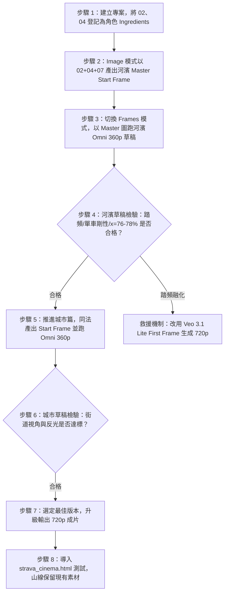

# Google Flow × Taiwan Ride Cinema：導演製片策略與精確點數生成指南（修訂版）

> **專案定位**：Steve 的台灣騎行電影（Taiwan Ride Cinema）三章節影片生成  
> **版本狀態**：正式修訂版（已校正官方計價、介面模式互斥限制與實際版面座標）  
> **帳號方案情境**：付費方案帳號（Google AI 付費訂閱），點數預算嚴格限制在 **50 點** 內。  
> **生成順序調整**：**河濱第一順位** → **城市第二順位** → **山路第三順位（現有素材已可用，有餘裕才重製）**。  
> **核心鐵律**：影片本體不得包含任何文字、浮水印、AF 框、相機 HUD 或網頁 UI。

---

## 零、介面機制實測與素材邊界規範

### 1. Google Flow 介面模式互斥確認
經比對 Flow 目前的工作面板架構：
- **`Ingredients to Video`** 與 **`Frames to Video (First Frame)`** 在單次生成中為**互斥的模式選單**，無法在同一個 Prompt 中同時勾選 Ingredients 又指定 First Frame。
- **正確認定之二階段標準工法**：
  - **階段 A（Ingredients to Image）**：在圖片模式中，掛載 Steve 真人特徵（`02`、`04`）與環境圖，以低成本（1–2 點）生成並確認構圖無誤的 **Master Start Frame**。
  - **階段 B（Frames to Video / First Frame）**：切換至 Video 模式，將該張 Master Start Frame 填入 **First Frame** 槽位，專注驅動相機 4% 推鏡與腿部踩踏動態。

### 2. 嚴格剔除 `06-ui-framing-reference.png`
- **問題診斷**：`06` 包含 AI 虛構的非本人面孔、偽裝的 Santini 車衣字樣，以及網頁 UI、AF 框與數據文字。**若將 `06` 誤放入 Flow 的任何 Ingredients 槽位，模型必會將錯誤人臉與浮水印雜訊學入影片。**
- **定位處置**：`06` 僅作為人眼與導演校對版面的外部參考圖，**絕對禁止上傳至 Flow 作為生成素材**。
- **實際生成素材清單（每段僅嚴選 3 張）**：
  - **河濱篇**：`02-steve-face-outfit-front.png` + `04-steve-riding-side-profile.png` + `07-riverside-environment.jpg`
  - **城市篇**：`02-steve-face-outfit-front.png` + `04-steve-riding-side-profile.png` + `08-taipei-city-color-reference.jpg`
  - **山路篇**：`02-steve-face-outfit-front.png` + `04-steve-riding-side-profile.png` + `05-road-lightning-environment.jpg`

### 3. 精確版面幾何座標（消除前後矛盾）
依據 `strava_cinema.html` 的實際卡片寬度與 Fuji 觀景窗安全區：
- **車手縱向中心軸**：嚴格錨定在畫面水平座標 **$x = 76\% \sim 78\%$**。
- **車手與單車佔據範圍**：分佈於畫面右側 **$68\% \sim 91\%$** 區間（頭盔頂部至膝部/大齒盤完整入鏡，前輪下緣允許微裁）。
- **左側數據安全負空間**：畫面左側 **$0\% \sim 55\%–58\%$** 必須保持乾淨的地景、水面或暗部，嚴禁車手、車身或障礙物侵入，確保數據卡片 100% 可讀。

---

## 壹、官方精確點數與模型能力對照

依 Google Flow 當前官方付費方案顯示標準，單次操作之點數扣除基準如下：

| 模型與模式 | 解析度與規格 | 單次扣除點數 | 適用場景與定位 |
| :--- | :--- | :---: | :--- |
| **Image (Imagen 3)** | 16:9 靜態圖 | **1 – 2 點** | 產出 Master Start Frame，鎖定五官與右側座標 |
| **Gemini Omni Flash** | 360p / 8 秒 / 16:9 | **6 點** | **第一梯隊**：快速驗證動態、踏頻與鏡位推移 |
| **Gemini Omni Flash** | 720p / 8 秒 / 16:9 | **12 點** | **第二梯隊**：通過驗收後的成片輸出（符合網站 720p 標準） |
| **Veo 3.1 Lite** | 720p / 8 秒 / First Frame | **10 點** | **救援梯隊**：Omni 物理失效時的精準單車動態修補 |
| **Veo 3.1 Fast** | 720p / 8 秒 | **20 點** | 高階動態渲染（本輪 50 點預算內暫不使用） |
| **Video-to-Video Edit** | 既有影片轉繪 | **40 點** | **禁止使用**：單次耗盡 80% 額度且易產生高頻閃爍 |

---

## 貳、50 點嚴格預算分配表（河濱優先・城市第二・山路候補）

本規劃依「**Omni 360p 探索驗證 → 通過後升至 720p → 物理異常時以 Veo 3.1 Lite 救援**」原則配置，確保 50 點內至少交付兩支全新場景：

| 步驟 | 目標場景 | 執行操作與模式 | 單次點數 | 累計點數 | 驗收判定指標 | 失敗應變處置 |
| :---: | :--- | :--- | :---: | :---: | :--- | :--- |
| **01** | 河濱 Start Frame | Image 模式產出起點圖 | 2 點 | 2 點 | 人物中心在 x=76–78%，左側 58% 留白 | 若瑕疵重產 1 次（累計 4 點） |
| **02** | 河濱（RIVER） | Omni 360p 8s 草稿 #1 | 6 點 | 8 點 | 踏頻流暢、手握煞把、向正前推鏡 | 若合格跳至 04；微瑕跳至 03 |
| **03** | 河濱（修正） | Omni 360p 8s 草稿 #2 (微調) | 6 點 | 14 點 | 驗證修正效果 | 若仍失敗，以 Veo 3.1 Lite 救援 |
| **04** | 城市 Start Frame | Image 模式產出起點圖 | 2 點 | 16 點 | 街道視角、右側 68–91%、無霓虹 | 若瑕疵重產 1 次（累計 18 點） |
| **05** | 城市（CITY） | Omni 360p 8s 草稿 #1 | 6 點 | 22 點 | 藍調夜色、路面反光、車速平穩 | 若合格跳至 07；微瑕跳至 06 |
| **06** | 城市（修正） | Omni 360p 8s 草稿 #2 (微調) | 6 點 | 28 點 | 驗證修正效果 | 擇優選定草稿版本 |
| **07** | **河濱成片輸出** | **Omni 720p 8s 高清渲染** | **12 點** | **40 點** | **交付河濱最終成片** | 存檔並匯入網站測試 |
| **08** | **城市成片輸出** | **Omni 720p 8s 高清渲染** | **12 點** | **52 點 (或保留)** | **交付城市最終成片** | 若前段有節餘或動態完美則執行 |
| **備註** | 山線重製 | — | — | — | 現有山線 17s 已達標，今日不耗點 | 待後續額度刷新再進行重製 |

> [!IMPORTANT]
> **物理救援機制（Veo 3.1 Lite Fallback）**：  
> 若在步驟 02 或 05 中，Omni 360p 出現不可接受的機械物理錯誤（如雙腿穿透下管、曲柄融化、車輪變形呈橢圓），**立即停止重試 Omni**，直接改用 **Veo 3.1 Lite 的 First Frame 模式（10 點）** 跑一次該場景的 720p。如此單場景總消耗為 $2 + 6 + 10 = 18$ 點，依然能將總預算壓在 50 點防線之內。

---

## 參、八步驟標準作業流程（Workflow）



---

## 肆、技術失敗判定清單（拒絕模糊估算）

當生成結果出現以下任何一項具體特徵時，即判定為該次生成失敗，立即依規則處理：

1. **構圖越界（UI 衝突）**：車手重心漂移至 $x < 65\%$，遮擋左側 Strava 數據區。
   - *處理*：回退檢查 Start Frame，並在 Prompt 開頭加強 `"Cyclist strictly restricted to right 68-91%"`。
2. **單車機械崩解（物理失敗）**：腳掌離開踏板、曲柄消失、小腿穿透車架下管、前輪左右扭曲大於 5 度。
   - *處理*：不再重試 Omni，直接切換 **Veo 3.1 Lite（10 點）** 以 First Frame 救援。
3. **特徵漂移（身份衝突）**：車衣轉為非黃色、出現文字/贊助商標、面孔轉換為非東亞面孔、或生成相機 AF 綠框/文字。
   - *處理*：剔除文字提示中的贅字，強調 `"Solid clean yellow jersey without graphics, plain frame"`。

---

## 伍、三章節即用英文 Prompt（依新構圖與順序排列）

### 1. 第一順位：RIVER／河濱（呼吸・夕陽・TEMPO）
```text
A cinematic, continuous 8-second tracking shot at 24fps, 16:9 landscape. Front three-quarter view of cyclist Steve riding along a flat asphalt riverside path in Taipei during humid golden hour.

COMPOSITION & FRAMING: The camera vehicle moves forward at matching cruising speed. Cyclist Steve is strictly positioned on the right side of the screen with his centerline anchored at x=76-78%, occupying the right 68-91% zone (helmet to crankset fully visible). The entire left 0-58% of the frame remains completely clean negative space showing calm river water, hazy sky, and distant bridge silhouettes.

CYCLIST & BIKE: Steve is an athletic East Asian male with real facial structure from reference, wearing a solid bright yellow cycling jersey, light gray bib shorts, matte black helmet, red-rimmed sports glasses, white gloves, and red road cycling shoes. Hands stay naturally on the brake hoods, seated rhythmic endurance pedaling, stable cadence, zero sprinting, zero body sway. Riding a dark metallic road bicycle, front wheel aligned strictly forward along the road vanishing point.

CAMERA & MOTION: Low tracking camera maintains fixed distance and performs one ultra-slow 4% optical push-in across the full 8 seconds, holding steady at the end. No zoom out, no panning.

LIGHTING & COLOR: Rich humid golden hour backlight with warm rim lighting along Steve's profile, muted cyan-gray water tones, soft highlight roll-off, fine organic 35mm film grain, restrained Eterna film palette. Consistent exposure and sky from first to last frame. Absolutely clean start and end frames without fade, cut, camera HUD, focus boxes, numbers, or text.
```

### 2. 第二順位：CITY／城市（速度・夜色・CADENCE）
```text
A cinematic, continuous 8-second tracking shot at 24fps, 16:9 landscape. Low front three-quarter tracking shot of cyclist Steve riding forward in a clean asphalt lane in Taipei during blue hour after rain.

COMPOSITION & FRAMING: The camera vehicle tracks forward smoothly at matching speed. Cyclist Steve is strictly positioned on the right side with his centerline anchored at x=76-78%, occupying the right 68-91% horizontal span. The left 0-58% of the frame is reserved as clean, dark, reflective negative space showing damp road texture and distant low-contrast urban depth.

CYCLIST & BIKE: Identical cyclist Steve: real East Asian face, solid bright yellow cycling jersey, light gray bib shorts, matte black helmet, red-rimmed glasses, red shoes, dark road bicycle. Hands stay relaxed on the brake hoods, steady seated pedaling cadence, upright stable geometry. No skidding, no leaning turns, no out-of-saddle efforts.

CAMERA & MOTION: Camera travels forward in the same lane looking backward toward Steve. One slow, continuous 4% optical push-in across the entire clip. Stable horizon line and unchanging vanishing point.

ENVIRONMENT & LIGHTING: Ground-level street cinema perspective. Wet asphalt with warm tungsten streetlight reflections and soft red traffic signal glimmers. Distant building silhouettes. Taipei 101 may only appear as a tiny, subtle, faint background shape in the far distance. Photorealistic documentary atmosphere, zero cyberpunk neon, zero crossing cars, zero readable signage, no text, no HUD, clean start and end frames with no fade.
```

### 3. 第三順位（候補）：MOUNTAIN／山線（意志・雷雨・EASE）
```text
A cinematic, continuous 8-second tracking shot at 24fps, 16:9 landscape. Front three-quarter view of cyclist Steve steadily climbing a humid Taiwan mountain road after rain.

COMPOSITION & FRAMING: Camera vehicle moves uphill ahead at matching speed. Cyclist Steve is anchored strictly on the right side with his centerline at x=76-78%, occupying the right 68-91% frame area. The left 0-58% remains wide-open, clean negative space showcasing mountain mist, distant ridges, and damp asphalt.

CYCLIST & BIKE: Identical cyclist Steve: authentic East Asian facial bone structure, solid bright yellow jersey, light gray bib shorts, matte black helmet, red-rimmed glasses, red shoes, dark road bicycle. Entirely seated, hands naturally resting on brake hoods, smooth low-cadence climbing effort, calm rhythmic breathing.

CAMERA & MOTION: Front three-quarter angle, single smooth 4% optical push-in across 8 seconds, holding at the final frame. Bicycle and front wheel point straight forward along the continuous uphill grade. No hairpins, no U-turns, no road reversal.

ATMOSPHERE & COLOR: Overcast humid Taiwan mountain pass, wet road reflections, roadside silver grass, dark uniform storm clouds with subtle distant sheet lightning contained within the same cloud layer. Locked color temperature and damp atmosphere throughout. Clean head and tail frames with no fade, no cut, no camera UI, and no text.
```

---

## 陸、各章節精選素材對照表（嚴禁上傳 06）

| 章節 | 專案 Ingredients 上傳檔案（嚴格限 3 張） | 角色分工目的 | 禁用素材提醒 |
| :--- | :--- | :--- | :--- |
| **河濱 (River)**<br>*(第一順位)* | 1. `02-steve-face-outfit-front.png`<br>2. `04-steve-riding-side-profile.png`<br>3. `07-riverside-environment.jpg` | `02` 鎖定臉孔、黃衣與紅鏡鞋；`04` 鎖定單車比例與坐姿；`07` 提供夕陽逆光色溫。 | **嚴禁上傳 `06`**（避免 AI 假臉與 UI 污染）<br>**嚴禁上傳 `03`**（避免壓彎動態干擾） |
| **城市 (City)**<br>*(第二順位)* | 1. `02-steve-face-outfit-front.png`<br>2. `04-steve-riding-side-profile.png`<br>3. `08-taipei-city-color-reference.jpg` | 沿用同一人物與單車，以 `08` 作為台北街道雨後夜色色調參考。 | 同上 |
| **山線 (Mountain)**<br>*(第三順位候補)* | 1. `02-steve-face-outfit-front.png`<br>2. `04-steve-riding-side-profile.png`<br>3. `05-road-lightning-environment.jpg` | 沿用同一人物與單車，以 `05` 作為陽明山雷雨濕氣環境參考。 | 同上 |
