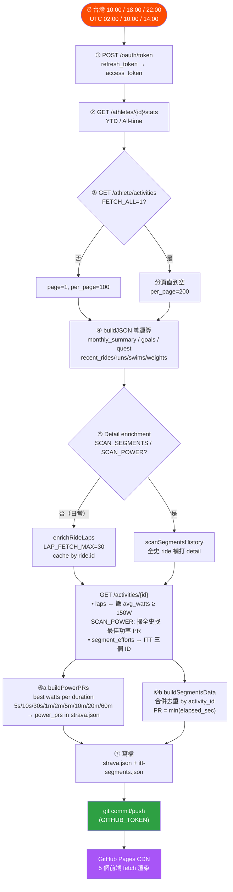

# SteveChuang · Personal Hub

> 太空主題個人入口網站，整合線上履歷與 Strava 運動儀表板。
> 部署於 GitHub Pages，每天透過 GitHub Actions 自動同步 Strava 資料（台灣時間 10:00 / 18:00 / 22:00）。

🔗 **Live：** https://chenhan20.github.io/linkTree/linkTreeIndex.html

---

## 頁面預覽

| 首頁 | Strava 儀表板 |
|------|--------------|
|  |  |

> 截圖放在 `docs/` 資料夾，檔名 `preview-home.png` / `preview-strava.png`

---

## 頁面結構

### 🏠 首頁（linkTreeIndex.html）
- Canvas 星空 + 流星 + 粒子動畫
- 火箭導航動畫
- 社群連結按鈕（Instagram、Facebook、YouTube、Strava、LinkedIn、GitHub）
- 跳轉 Resume 頁面

### 📄 Resume（SPA 內頁）
- 工作經歷時間軸
- Side Projects 展示
- 技能進度條動畫
- 學歷、興趣標籤

### 🚴 Strava 儀表板（strava.html）
- 年度總覽：里程、爬升、次數、時數
- 功率 PR 紀錄（最佳 5s / 10s / 30s / 1m / 2m / 5m / 10m / 20m / 60m）
- 月度里程長條圖
- 活動紀錄：單車 / 跑步 / 游泳 / 重訓分頁
- All Time 累計數據
- 每天 10:00 / 18:00 / 22:00（台灣時間）自動更新

---

## 技術棧

| 類別 | 技術 |
|------|------|
| 前端框架 | Vue 3 (CDN, Composition API) |
| 動畫 | Canvas API、CSS Animation |
| 資料同步 | Strava OAuth 2.0 + GitHub Actions |
| 部署 | GitHub Pages（靜態，零後端） |

---

## Strava 自動同步流程

### 🍼 笨蛋版（30 秒看懂）

> 想像 Strava 是「便利商店」、`strava.json` 是「冰箱裡的便當」、網頁是「飯桌」。

```
台灣時間每天三次（10:00 / 18:00 / 22:00）
   ↓
機器人（GitHub Actions）拿著鑰匙去 Strava 便利商店
   ↓
把所有運動紀錄打包成一個便當盒（strava.json）
   ↓
放回家裡冰箱（commit + push 回 repo）
   ↓
你打開網頁 → 網頁從冰箱拿便當出來顯示
```

**重點**：網頁本身**不會**直接打 Strava，它只看「冰箱裡那個便當」。
所以如果剛運動完、便當還沒更新，網頁就還是舊的 → 這時候去手動催一下機器人就好。

**手動催機器人的 3 個情境**：

| 情境 | 怎麼做 |
|------|-------|
| 平常剛運動完想立刻看到 | GitHub repo → Actions → **Strava Daily Sync** → Run workflow |
| 想拉「以前全部」歷史活動（首次或重灌） | 本機跑 `$env:FETCH_ALL="1"; $env:SCAN_SEGMENTS="1"; node scripts/fetch-strava.js` |
| 想補抓特定 ITT 區段最新成績 | 同上，或直接讓每天的 cron 自動跑 |

**便當盒裡有什麼**（`strava.json` 結構）：
- 🏆 年度/全時間統計（YTD、All Time）
- ⚡ 功率 PR 紀錄（best watts by duration: 5s–60m）
- 📅 每月里程歷史
- 🚴 / 🏃 / 🏊 / 🏋️ 全部活動清單（含 Strava activity_id）
- ⛰️ ITT 區段成績（風櫃嘴 / 中社路 / 圓山-社子島）

---

### 🛠️ 工程師版（可實作細節）

> 完整流程圖（含分支、API 細節、快取邏輯）見 [docs/data-flow.md](docs/data-flow.md)



#### 環境變數（`scripts/.env` 或 GitHub Secrets）

| 變數 | 必填 | 用途 |
|------|------|------|
| `STRAVA_CLIENT_ID` | ✅ | Strava App ID |
| `STRAVA_CLIENT_SECRET` | ✅ | Strava App Secret |
| `STRAVA_REFRESH_TOKEN` | ✅ | OAuth refresh token（需 `activity:read_all` scope） |
| `STRAVA_ATHLETE_ID` | ✅ | 自己的 athlete ID |
| `FETCH_ALL` | ⬜ | `=1` 拉全史；省略則只拉最近 100 筆 |
| `SCAN_SEGMENTS` | ⬜ | `=1` 對全史 ride 掃 ITT segment efforts |
| `SCAN_POWER` | ⬜ | `=1` 重掃功率 PR（會搭配全量活動，避免只掃最近 100 筆） |
| `POWER_ONLY` | ⬜ | `=1` 只更新功率 PR，跳過 laps/segments enrichment |
| `REFRESH_LAPS` | ⬜ | `=1` 忽略 lap 快取重新抓 |
| `LAP_FETCH_MAX` | ⬜ | 單次最多打多少 detail call（預設 30，避 rate limit） |

#### Strava API rate limit
- **100 requests / 15 min**, **1000 / day**（讀取類）
- 全史掃描 263 筆活動 ≈ 263 detail calls → 必須分批 + `setTimeout(400ms)` 節流
- 全量首跑建議分兩次：先 `FETCH_ALL=1` 拉清單，等 15 分後再 `SCAN_SEGMENTS=1` 掃 segment

#### 前端讀取
- 6 個主題（[strava.html](strava.html) / [strava_aespa.html](strava_aespa.html) / [strava_cs.html](strava_cs.html) / [strava_maple.html](strava_maple.html) / [strava_lol.html](strava_lol.html) / [strava_halo.html](strava_halo.html)）共用同一份 `strava.json`
- 純 `fetch()` + 字串模板渲染，無框架、無 build step
- 每張活動卡右上角 `↗` 直連 `https://www.strava.com/activities/{id}`
- ITT 區段表格點任一列 → 自動切到「全部」tab + 展開 Show More + 捲動高亮對應活動

#### 本機快速測試

```powershell
# 1. 建 scripts/.env（複製 4 個 secret）
# 2. 連線測試
.\scripts\test-strava-api.ps1                       # 看 token + 最近 10 筆
.\scripts\test-strava-api.ps1 -ActivityId 12345678  # 看單筆 lap

# 3. 跑同步（本機寫 strava.json）
node scripts/fetch-strava.js                                    # 增量
$env:FETCH_ALL="1"; $env:SCAN_SEGMENTS="1"; node scripts/fetch-strava.js  # 全量
$env:FETCH_ALL="1"; $env:SCAN_SEGMENTS="1"; $env:SCAN_POWER="1"; node scripts/fetch-strava.js  # 全量含功率 PR
$env:SCAN_POWER="1"; $env:POWER_ONLY="1"; node scripts/fetch-strava.js  # 只補功率 PR（建議日常補全）

# 4. 單獨重掃功率 PR（快取清乾淨）
rm -f power-prs.json power-prs-cache.json && $env:SCAN_POWER="1"; node scripts/fetch-strava.js
```

#### 手動觸發 GitHub Actions
**GitHub repo → Actions → Strava Daily Sync → Run workflow**

---

## 本機開發

不需要安裝任何套件，直接用 VS Code Live Server 或：

```bash
# 用 Python 起一個 static server
python -m http.server 8080
```

開啟 http://localhost:8080/linkTreeIndex.html

---

## GitHub Secrets 設定

需要在 **Settings → Secrets and variables → Actions** 設定：

| Secret | 說明 |
|--------|------|
| `STRAVA_CLIENT_ID` | Strava App Client ID |
| `STRAVA_CLIENT_SECRET` | Strava App Client Secret |
| `STRAVA_REFRESH_TOKEN` | OAuth 2.0 Refresh Token（需含 `activity:read_all` scope） |
| `STRAVA_ATHLETE_ID` | 你的 Strava Athlete ID |
