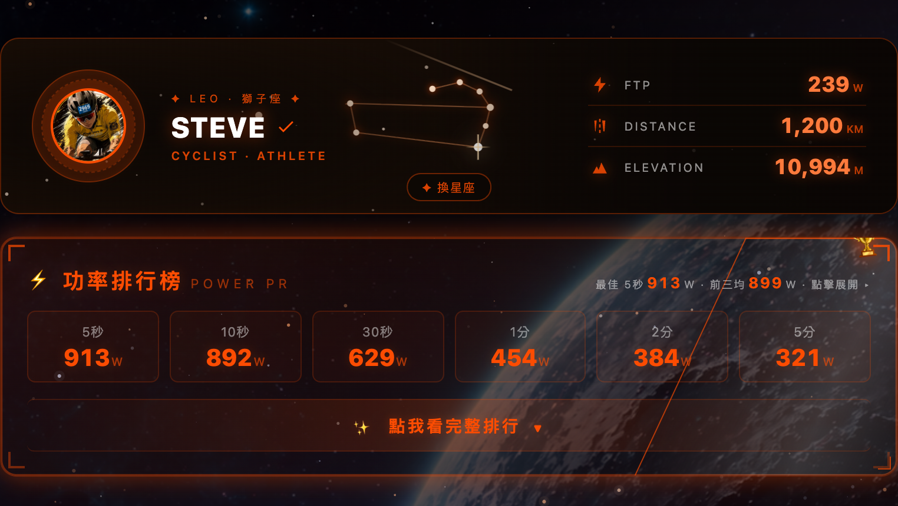
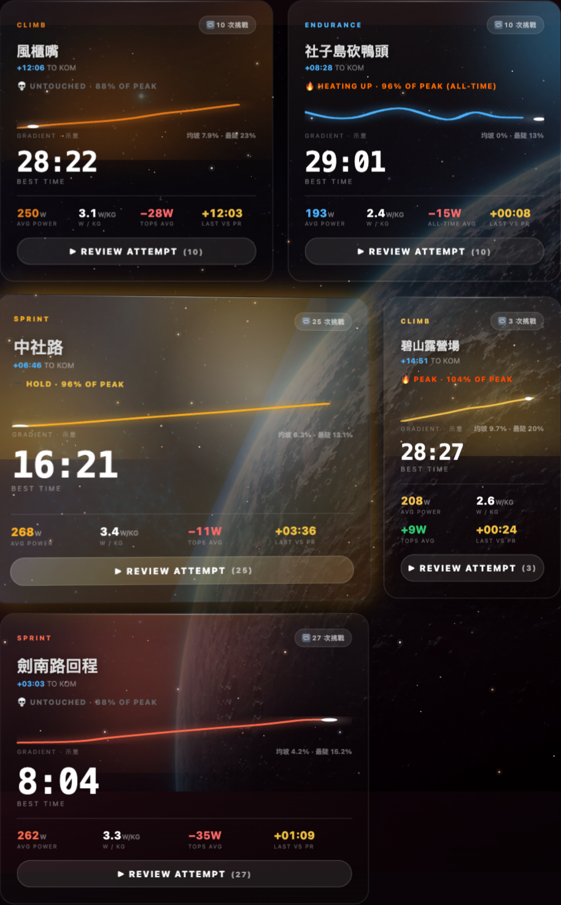
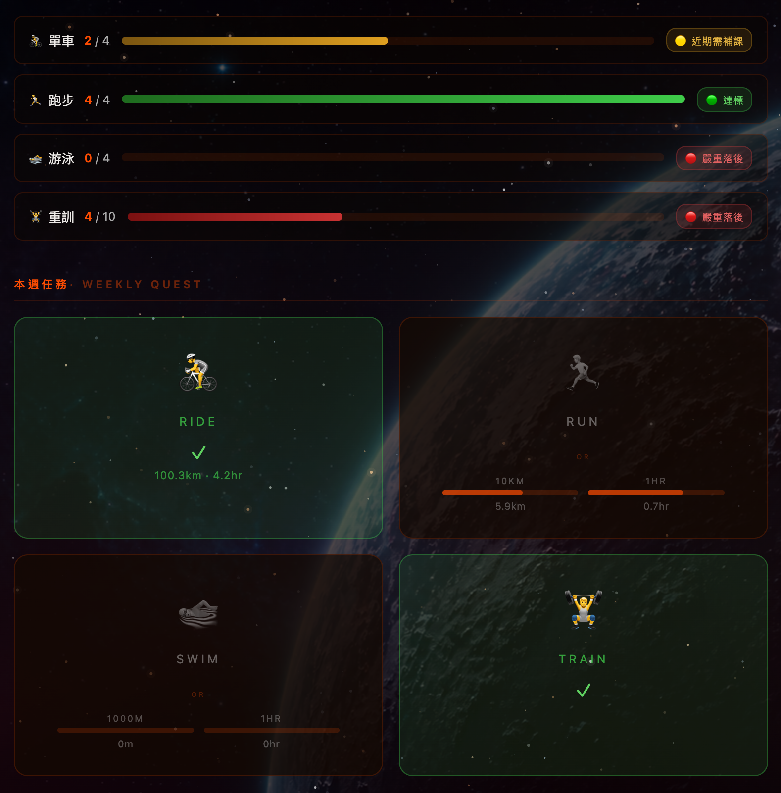
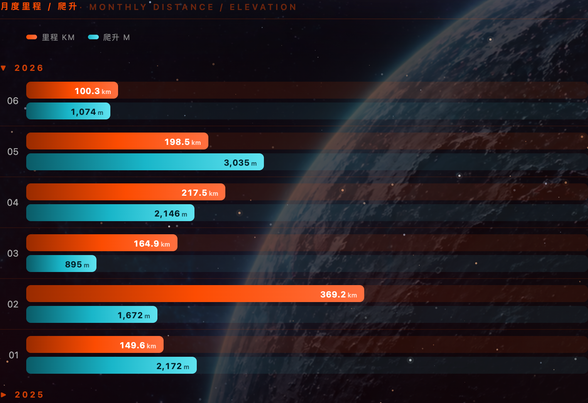
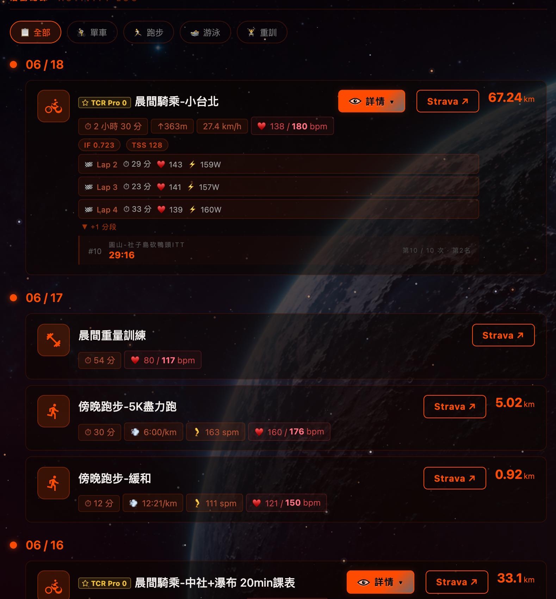
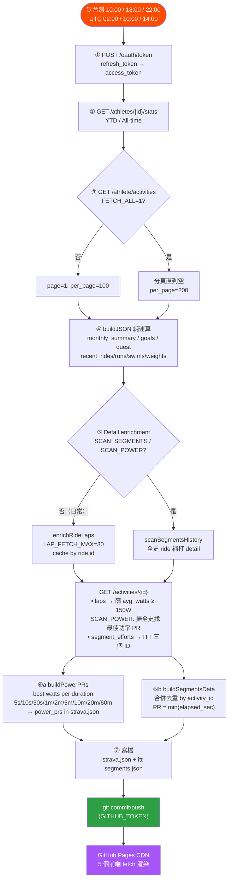

# SteveChuang · Personal Hub

> 個人入口網站，整合線上履歷與運動儀表板。部署於 GitHub Pages，兩條 GitHub Actions 管線每天自動更新：
>
> | 管線 | 排程（台灣時間） | 來源 → 產出 |
> |---|---|---|
> | **Strava Daily Sync** | 10:00 / 18:00 / 22:00 | Strava API → `data/strava.json` → 儀表板總覽 |
> | **FIT Sync** | 10:30 / 22:30 | intervals.icu 的 Garmin **原始 FIT** → `data/fit/*.fit` → `rides/<date>.html` 單日訓練報告 |
>
> 兩條完全獨立。整條管線是純 Python / Node，**沒有任何 LLM 參與、零推論成本**。
>
> Strava 儀表板同一份資料有**四個**並存的視覺世界，從首頁的 STEVE 專用版那一列選一個進入：
> **深空觀測站**（`strava.html`）、**維修站牆**（`strava_pitwall.html`）、
> **記震紙**（`strava_helicorder.html`）、**遙測 OPUS MAX**（`strava_opus5_max.html`）。

🔗 **Live：** https://chenhan20.github.io/linkTree/linkTreeIndex.html

---

## 頁面預覽

> 截圖放在 `docs/` 資料夾，檔名 `preview-home.png` / `preview-strava.png`

---

## 🚴 Strava 儀表板 · 重點功能

> 資料每天自動同步。以下截圖為**深空觀測站**（`strava.html`）的桌面版畫面；
> 功能與資料四個世界共通，只有視覺語言不同。

### 星座名片 + 功率排行榜
即時星座動畫名片（FTP / 里程 / 爬升），下方為最佳功率 PR（5s ~ 60m）排行。



### ITT 區間 · Fusion 卡片
自訂計時賽路段，液態玻璃 + 全息傾斜 + Bento 排版的卡片：卡片大小依挑戰次數自動縮放、內建依真實 altitude/grade stream 畫出的坡度示意曲線，滑鼠移過去有 3D 傾斜與全息光澤，並保留最佳成績、功率、狀態評分（UNTOUCHED / HEATING UP / PEAK...）等既有判斷邏輯。



### 月度紀律 + 本週任務
各運動項目月度達標進度，以及單車 / 跑步 / 游泳 / 重訓的每週任務挑戰。



### 月度里程 / 爬升 + 活動紀錄

| 月度里程 / 爬升 | 活動紀錄時間軸 |
|------|------|
|  |  |

---

## 頁面結構

### 🏠 首頁（linkTreeIndex.html）
- Canvas 星空 + 流星 + 粒子動畫
- 火箭導航動畫
- 社群連結按鈕（Instagram、Facebook、YouTube、Strava、LinkedIn、GitHub）
- 跳轉 Resume 頁面

### 📄 Resume（SPA 內頁）
- 工作經歷時間軸
- Side Projects 展示
- 技能進度條動畫
- 學歷、興趣標籤

### 🚴 Strava 儀表板（四個世界共用同一份資料）

共通內容：
- 年度總覽：里程、爬升、次數、時數
- 功率 PR 紀錄（最佳 5s / 10s / 30s / 1m / 2m / 5m / 10m / 20m / 60m）
- 月度里程長條圖
- 活動紀錄：單車 / 跑步 / 游泳 / 重訓分頁
- ITT 區間：路段狀態評分、3D 路線回放、同事 PK 與自我對戰
- All Time 累計數據
- 每天 10:00 / 18:00 / 22:00（台灣時間）自動更新

| 檔案 | 世界 | 視覺語言 |
|------|------|----------|
| `strava.html` | 深空觀測站 | 星空背景、signal-orange、液態玻璃 + 全息傾斜 + Bento 卡片 |
| `strava_pitwall.html` | 維修站牆 | 消光石板黑 + 粉筆白，板牌（極大字）與計時紙（密集分段秒數）兩個語域；分段計時四色（紫＝90 天內最佳／綠＝歷史 PR／黃＝比自己慢／灰＝尚未計時）是唯一彩色，且只表功能。無發光、無毛玻璃、無 webfont |
| `strava_helicorder.html` | 記震紙 | 地震儀記錄紙：訓練連續紀錄畫成連續走紙的波形 |
| `strava_opus5_max.html` | 遙測 OPUS MAX | 青色遙測 |

`strava_aespa.html` / `strava_maple.html` / `strava_cs.html` / `strava_lol.html` / `strava_halo.html`
是更早的五個主題頁，檔案保留、直接開網址仍可用，但不再出現在任何導覽裡。

> ⚠️ **`DESIGN.md` 只管 `strava.html` 一個世界。** 設計工具對其他世界報的
> design-system drift 是預期的，不要照著改 —— 那會把各世界拉成同一種語言。
> 同理，任何設計指令都要指定單一檔案，不要掃全 repo。

---

## 技術棧

| 類別 | 技術 |
|------|------|
| 前端 | 純 HTML / CSS / JS，無框架，無 build step |
| 動畫 | Canvas API、CSS Animation |
| 資料同步 | Strava OAuth 2.0 + GitHub Actions |
| 部署 | GitHub Pages（靜態，零後端） |

---

## 🔧 Fork 後自己用（給其他人完整串接教學）

> 想用自己的 Strava 帳號跑同一套？整套流程約 10–15 分鐘，**不需要寫任何程式**。

### 前置
- GitHub 帳號（要能開 GitHub Pages）
- Strava 帳號（有運動紀錄）

---

### Step 1 · Fork 此 repo

1. 點右上角 **Fork** → 建到自己的帳號下
2. **Settings → Pages** → Source 選 `main` branch，Folder 選 `/(root)`
3. 記下 Pages URL：`https://{你的帳號}.github.io/{repo名稱}/`

---

### Step 2 · 建立 Strava API App（拿 client_id / client_secret）

1. 前往 https://www.strava.com/settings/api
2. 點 **Create & Manage Your App**
3. 填寫：
   - **Application Name**：隨意（例：MyStravaSync）
   - **Category**：Data Importer
   - **Authorization Callback Domain**：填 `localhost`（給下一步授權用）
4. 建立後記下：
   - `Client ID`（純數字）
   - `Client Secret`（長字串）

---

### Step 3 · 取得 OAuth Refresh Token（一次性授權）

讓 GitHub Actions 機器人可以代你讀取資料。Refresh token 取得後**永久有效**（除非你撤銷）。

```powershell
# (a) 瀏覽器開以下 URL，把 YOUR_CLIENT_ID 換成 Step 2 的 Client ID
# https://www.strava.com/oauth/authorize?client_id=YOUR_CLIENT_ID&redirect_uri=http://localhost&response_type=code&scope=activity:read_all

# (b) 同意授權後瀏覽器會跳到 localhost（連線失敗沒關係）
#     從網址列複製 code= 後面那串：
#     http://localhost/?state=&code=abc123xyz&scope=read,activity:read_all
#                              ↑ 這段就是 code（只能用一次）

# (c) 用 code 換 refresh_token
$body = "client_id=YOUR_CLIENT_ID&client_secret=YOUR_CLIENT_SECRET&code=abc123xyz&grant_type=authorization_code"
Invoke-RestMethod -Method POST -Uri "https://www.strava.com/oauth/token" -Body $body
# 回傳 JSON 的 "refresh_token" 欄位，複製下來（很長一串）
```

---

### Step 4 · 設定 GitHub Secrets（把 4 個值塞進 repo）

前往 **Settings → Secrets and variables → Actions → New repository secret**，逐一建立：

| Secret 名稱 | 值來源 |
|------------|--------|
| `STRAVA_CLIENT_ID` | Step 2 |
| `STRAVA_CLIENT_SECRET` | Step 2 |
| `STRAVA_REFRESH_TOKEN` | Step 3 |
| `STRAVA_ATHLETE_ID` | Strava 登入後網址 `/athletes/數字`，那個數字就是 |

---

### Step 5 · 首次全量同步

**GitHub repo → Actions → Strava Daily Sync → Run workflow**，勾選「全量抓取」後按 Run。

> 首次跑完，`data/strava.json` 和 `data/itt-segments.json` 會被 commit 回 repo，之後每天台灣時間 10:00 / 18:00 / 22:00 自動增量更新。

---

### Step 6 · 設定 ITT 路段（選用）

想追蹤特定 Strava Segment 的計時成績，編輯 [data/itt-config.json](data/itt-config.json)：

```json
{
  "segments": [
    {
      "id": 641218,
      "nameZh": "風櫃嘴",
      "nameApi": "風櫃嘴ITT",
      "type": "CLIMB",
      "accent": "#e87c1a"
    }
  ]
}
```

- **找 Segment ID**：Strava 網頁開啟路段，URL 中的數字 `https://www.strava.com/segments/`**`641218`**
- **`type` 可選**：`CLIMB` / `SPRINT` / `ENDURANCE`
- **`accent` 配色有語意**：山路走暖色家族（橘／琥珀／金／珊瑚），河濱平路走藍色家族。
  不要再開第二個高飽和冷色（綠／紫／青），會跟其他版塊打架。

加完之後跑兩步：

```bash
# 1. 補抓成績（Actions → Strava Daily Sync → 勾 scan_segments）
#    它會自動改用全量並關掉 power_only，不必自己記
# 2. 補抓路段折線與地形（本機，只抓缺的、約 3-6 次 API）
node scripts/fetch-segment-streams.js
node scripts/fetch-segment-terrain.js
```

> ⚠️ **不要為了新路段跑全史掃描**。全史掃描會對每趟騎乘打一次 detail API，
> 很容易撞到 Strava 的讀取額度上限（實測就是這樣爆掉的，路段 metadata 全部沒抓到）。
> 上面那兩支專用腳本只抓缺的路段，成本是全史掃描的零頭。
>
> 額度撞牆時等 15 分鐘的窗口過去再跑一次即可，已抓到的不會重抓。

`strava.html` 不需要改任何一行，九條路段的卡片、3D 路線圖、自建計時都會自動出現。

---

## Strava 自動同步流程

### 🍼 笨蛋版（30 秒看懂）

> 想像 Strava 是「便利商店」、`strava.json` 是「冰箱裡的便當」、網頁是「飯桌」。

```
台灣時間每天三次（10:00 / 18:00 / 22:00）※ 這節只講 Strava；FIT 管線見上面「FIT 管線」章
   ↓
機器人（GitHub Actions）拿著鑰匙去 Strava 便利商店
   ↓
把所有運動紀錄打包成一個便當盒（strava.json）
   ↓
放回家裡冰箱（commit + push 回 repo）
   ↓
你打開網頁 → 網頁從冰箱拿便當出來顯示
```

**重點**：網頁本身**不會**直接打 Strava，它只看「冰箱裡那個便當」。
所以如果剛運動完、便當還沒更新，網頁就還是舊的 → 這時候去手動催一下機器人就好。

**手動催機器人的 3 個情境**：

| 情境 | 怎麼做 |
|------|-------|
| 平常剛運動完想立刻看到 | GitHub repo → Actions → **Strava Daily Sync** → Run workflow |
| 想拉「以前全部」歷史活動（首次或重灌） | 本機跑 `$env:FETCH_ALL="1"; $env:SCAN_SEGMENTS="1"; node scripts/fetch-strava.js` |
| 想補抓特定 ITT 區段最新成績 | 同上，或直接讓每天的 cron 自動跑 |

**便當盒裡有什麼**（`strava.json` 結構）：
- 🏆 年度/全時間統計（YTD、All Time）
- ⚡ 功率 PR 紀錄（best watts by duration: 5s–60m）
- 📅 每月里程歷史
- 🚴 / 🏃 / 🏊 / 🏋️ 全部活動清單（含 Strava activity_id）
- ⛰️ ITT 區段成績（風櫃嘴 / 中社路 / 圓山-社子島）

---

### 🛠️ 工程師版（可實作細節）

> 完整流程圖（含分支、API 細節、快取邏輯）見 [docs/data-flow.md](docs/data-flow.md)


```mermaid
flowchart TD
  Cron(["⏰ 台灣 10:00 / 18:00 / 22:00<br/>UTC 02:00 / 10:00 / 14:00"]) --> Token
  Token["① POST /oauth/token<br/>refresh_token → access_token"] --> Stats
  Stats["② GET /athletes/{id}/stats<br/>YTD / All-time"] --> Acts
  Acts{"③ GET /athlete/activities<br/>FETCH_ALL=1?"}
  Acts -- 否 --> ActsR["page=1, per_page=100"]
  Acts -- 是 --> ActsA["分頁直到空<br/>per_page=200"]
  ActsR --> Build
  ActsA --> Build
  Build["④ buildJSON 純運算<br/>monthly_summary / goals / quest<br/>recent_rides/runs/swims/weights"] --> Mode
  Mode{"⑤ Detail enrichment<br/>SCAN_SEGMENTS / SCAN_POWER?"}
  Mode -- 否（日常） --> Daily["enrichRideLaps<br/>LAP_FETCH_MAX=30<br/>cache by ride.id"]
  Mode -- 是 --> Scan["scanSegmentsHistory<br/>全史 ride 補打 detail"]
  Daily --> Detail
  Scan --> Detail
  Detail["GET /activities/{id}<br/>• laps → 篩 avg_watts ≥ 150W<br/>  SCAN_POWER: 掃全史找最佳功率 PR<br/>• segment_efforts → ITT 三個 ID"]
  Detail --> Power["⑥a buildPowerPRs<br/>best watts per duration<br/>5s/10s/30s/1m/2m/5m/10m/20m/60m<br/>→ power_prs in strava.json"]
  Detail --> Segs["⑥b buildSegmentsData<br/>合併去重 by activity_id<br/>PR = min(elapsed_sec)"]
  Power --> Write
  Segs --> Write
  Write["⑦ 寫檔<br/>strava.json + itt-segments.json"]
  Write --> Push["git commit/push<br/>(GITHUB_TOKEN)"]
  Push --> Pages["GitHub Pages CDN<br/>5 個前端 fetch 渲染"]

  style Cron fill:#FC4C02,color:#fff
  style Push fill:#2ea043,color:#fff
  style Pages fill:#a855f7,color:#fff
```

#### 環境變數（`scripts/.env` 或 GitHub Secrets）

| 變數 | 必填 | 用途 |
|------|------|------|
| `STRAVA_CLIENT_ID` | ✅ | Strava App ID |
| `STRAVA_CLIENT_SECRET` | ✅ | Strava App Secret |
| `STRAVA_REFRESH_TOKEN` | ✅ | OAuth refresh token（需 `activity:read_all` scope） |
| `STRAVA_ATHLETE_ID` | ✅ | 自己的 athlete ID |
| `FETCH_ALL` | ⬜ | `=1` 拉全史；省略則只拉最近 100 筆 |
| `SCAN_SEGMENTS` | ⬜ | `=1` 對全史 ride 掃 ITT segment efforts |
| `SCAN_POWER` | ⬜ | `=1` 重掃功率 PR（會搭配全量活動，避免只掃最近 100 筆） |
| `POWER_ONLY` | ⬜ | `=1` 只更新功率 PR，跳過 laps/segments enrichment |
| `REFRESH_LAPS` | ⬜ | `=1` 忽略 lap 快取重新抓 |
| `LAP_FETCH_MAX` | ⬜ | 單次最多打多少 detail call（預設 30，避 rate limit） |

#### Strava API rate limit
- **100 requests / 15 min**, **1000 / day**（讀取類）
- 全史掃描 263 筆活動 ≈ 263 detail calls → 必須分批 + `setTimeout(400ms)` 節流
- 全量首跑建議分兩次：先 `FETCH_ALL=1` 拉清單，等 15 分後再 `SCAN_SEGMENTS=1` 掃 segment

#### 前端讀取
- 6 個主題（[strava.html](strava.html) / [strava_aespa.html](strava_aespa.html) / [strava_cs.html](strava_cs.html) / [strava_maple.html](strava_maple.html) / [strava_lol.html](strava_lol.html) / [strava_halo.html](strava_halo.html)）共用同一份 `strava.json`
- 純 `fetch()` + 字串模板渲染，無框架、無 build step
- 每張活動卡右上角 `↗` 直連 `https://www.strava.com/activities/{id}`
- ITT 區段表格點任一列 → 自動切到「全部」tab + 展開 Show More + 捲動高亮對應活動

#### 本機快速測試

```powershell
# 1. 建 scripts/.env（複製 4 個 secret）
# 2. 連線測試
.\scripts\test-strava-api.ps1                       # 看 token + 最近 10 筆
.\scripts\test-strava-api.ps1 -ActivityId 12345678  # 看單筆 lap

# 3. 跑同步（本機寫 strava.json）
node scripts/fetch-strava.js                                    # 增量
$env:FETCH_ALL="1"; $env:SCAN_SEGMENTS="1"; node scripts/fetch-strava.js  # 全量
$env:FETCH_ALL="1"; $env:SCAN_SEGMENTS="1"; $env:SCAN_POWER="1"; node scripts/fetch-strava.js  # 全量含功率 PR
$env:SCAN_POWER="1"; $env:POWER_ONLY="1"; node scripts/fetch-strava.js  # 只補功率 PR（建議日常補全）

# 4. 單獨重掃功率 PR（快取清乾淨）
rm -f power-prs.json power-prs-cache.json && $env:SCAN_POWER="1"; node scripts/fetch-strava.js
```

#### 手動觸發 GitHub Actions
**GitHub repo → Actions → Strava Daily Sync → Run workflow**

---

## 🏔 FIT 管線 · 單日訓練報告

Strava 給的是**處理過**的數字；Garmin 的**原始 FIT** 才有左右平衡、錶上 FTP、
真實功率區間邊界、逐秒功率。這條管線把原始檔拿回來，產出單日訓練報告。

### 為什麼是 intervals.icu

Garmin 官方 Developer API 是法人限定，個人申請不到。
[intervals.icu](https://intervals.icu) 是 Garmin **官方核准的 partner**，
Garmin 用官方 webhook 主動 push 活動給它，再用它的開放 API 拿原始檔即可 ——
沒有 Garmin 帳密、沒有 MFA、沒有 Cloudflare、不挑 IP、免費。
關鍵洞察是：**你申請不到官方 API，但可以免費用別人已經拿到的。**

完整脈絡與驗證紀錄見 [docs/fit-pipeline.md](docs/fit-pipeline.md)、
API 盤點見 [docs/intervals-api-survey.md](docs/intervals-api-survey.md)。

```
intervals.icu ──► data/fit/*.fit
                     │
                     ├─► analyze_tcx.py ──► render_dashboard.py ──► rides/<date>.html
                     │                            ▲
                     │        data/plan.json ──► score.py（課表對帳評分）
                     │                            │
                     │                            └─► data/training-block.json 的 actual
                     │
                     └─► segments.py（自建 ITT 計時，不靠 Strava）
```

### 產報告的門檻

一年 150+ 趟全出會讓 `rides/` 變垃圾場，所以預設是 **有功率 且 TSS ≥ 100**，
外加兩個例外：當天有教練評語（完全豁免）、當天有 ITT 成績（**只豁免 TSS，
沒有功率仍然不合格**）。同一天有多個 FIT 時做同日去重，且**有功率的檔優先於無功率的**
—— 不然肌力訓練會蓋掉同一天的騎乘報告。

### 課表對帳評分

報告原本用一個通用指標判斷「有沒有在練」：IF < 0.75 的時間算「移動但沒在練」。
**那是爬坡指標** —— 爬坡低功率＝滑行＝真沒練，但平路課表的低功率是**處方寫死的**
熱身與恢復。校準日那種協定光是熱身＋緩衝＋收操就有 40 分鐘照規定該低於門檻，
於是指標會給出「你在爽騎」這種與事實相反的結論。

現在改成：**有處方就對帳處方**（`data/plan.json`），沒有處方的自由騎才退回通用邏輯。
逐段列出「處方 vs 實際」，規則寫成可執行的形式（例如「功率不得低於 165W 超過 10 秒」
會真的逐秒去數並列出每次發生的時間點），四個維度各自附原始數字：

| 維度 | 看什麼 |
|---|---|
| 執行度 | 主課段實際平均功率 vs 處方區間 |
| 紀律 | 逐秒執行 `plan.json` 的 `rules[]` |
| 續航 | 主課段前半 vs 後半的衰減 |
| 迴轉 | 落在目標迴轉區間的時間佔比 |

分數會回填進 `data/training-block.json` 的 `sessions[].actual`，
儀表板的「週期」章與活動卡徽章就是讀那裡。

### 自建 ITT 計時（去 Strava 化的關鍵）

`tools/tcx/segments.py` 用 `data/segment-streams.json` 的折線做**垂直閘門線＋
相鄰兩點插值**求穿越時刻（不能用半徑判定 —— 50 km/h 每秒跳 13.9 m，會整段跨過去），
加上起點方位角同向判斷與折線中點檢查擋掉反向與抄捷徑。

實測與 Strava 官方在可比的 19 筆 effort 上**全數吻合，最大差 2.0 秒**；
新增路段第一次上場也只差 0.6 秒。而且它抓到過 Strava 沒配對到的成績 ——
**Strava 訂閱到期後不只不會失去資料，還會拿到 Strava 沒給的。**

---

## 資料檔結構

| 檔案 | 角色 | 誰維護 |
|------|------|--------|
| `data/strava.json` | 主資料：stats / 活動清單 / ITT segments / 功率 PR | 自動（Strava Sync） |
| `data/itt-segments.json` | ITT 努力紀錄 | 自動（Strava Sync） |
| `data/power-prs.json` | 功率 PR 快取 | 自動（Strava Sync） |
| `data/segment-streams.json` | ITT 路段的官方折線（每條 140 點，給 3D 路線圖與自建偵測器） | 自動（新增路段後跑一次） |
| `data/segment-terrain.json` | ITT 路段的地形高程（Tilezen DEM） | 自動（新增路段後跑一次） |
| `data/fit/*.fit` | **Garmin 原始 FIT**，訓練報告與 ITT 偵測器的資料源 | 自動（FIT Sync） |
| `data/fit/_activities.json` | 活動 metadata（**FIT 格式沒有活動名稱欄位**，標題唯一來源） | 自動（FIT Sync） |
| `data/fit/_reports.json` | 哪些 FIT 已產過報告、用了什麼標題 | 自動（FIT Sync） |
| **`data/itt-config.json`** | **ITT 路段設定（中文名、類型、顏色）** | **手動** |
| **`data/plan.json`** | **課表處方（每段目標瓦數／迴轉／可執行的規則）** | **手動** |
| **`data/training-block.json`** | **訓練週期計畫；`target` 手寫，`actual` 由 FIT Sync 回填** | **半自動** |
| `rides/<date>.html` | 單日訓練報告 | 自動（FIT Sync） |
| `rides/notes/<date>.json` | 教練評語（有的話標題與評語都以它為準，重生不會洗掉） | **手動** |

> 名言語錄已搬到獨立 repo [steve-quotes](https://github.com/chenhan20/steve-quotes)，
> 前端走 jsDelivr 取用，本 repo 不再存放語錄資料。

---

## 本機開發

不需要安裝任何套件，直接用 VS Code Live Server 或：

```bash
# 用 Python 起一個 static server
python -m http.server 8080
```

開啟 http://localhost:8080/linkTreeIndex.html

### FIT 管線的本機指令

```bash
pip install -r tools/tcx/requirements.txt      # 只需要 fitdecode

# 抓 FIT（需要 INTERVALS_API_KEY）
INTERVALS_API_KEY=xxx python3 scripts/sync-intervals.py --status
INTERVALS_API_KEY=xxx python3 scripts/sync-intervals.py --backfill 90

# 產報告（--dry-run 只看判斷不寫檔）
python3 scripts/build-ride-reports.py --dry-run
python3 scripts/build-ride-reports.py --only 2026-08-13 --overwrite

# 單獨用某支工具
python3 tools/tcx/score.py    data/fit/2026-08-13_*.fit --date 2026-08-13   # 課表對帳評分卡
python3 tools/tcx/segments.py data/fit/2026-08-13_*.fit                     # 自建 ITT 計時
```

> 🍎 **macOS 專屬的坑**：python.org 的 framework build 沒有 CA bundle，
> 任何 https 都會 `CERTIFICATE_VERIFY_FAILED`。不必裝 certifi，
> **每個指令前面帶 `SSL_CERT_FILE=/etc/ssl/cert.pem` 就好**（系統內建的 bundle）。
> CI 的 ubuntu runner 沒有這個問題。

### 常見情境

| 想做什麼 | 怎麼做 |
|---|---|
| 剛騎完想立刻看到報告 | Actions → **FIT Sync** → Run workflow（留空就是日常增量） |
| 回補歷史 | 同上，`backfill` 填天數（例如 `90`） |
| 改了活動名稱想讓報告標題跟著變 | 在 Garmin Connect 或 intervals.icu 改名即可，下次 FIT Sync 會偵測到標題變了並自動重生報告 |
| 新增 ITT 路段 | 見上面 Step 6 |
| 想重生所有報告 | FIT Sync 的 `rebuild` 勾起來（會保留教練評語，且肌力訓練不會蓋掉騎乘） |
