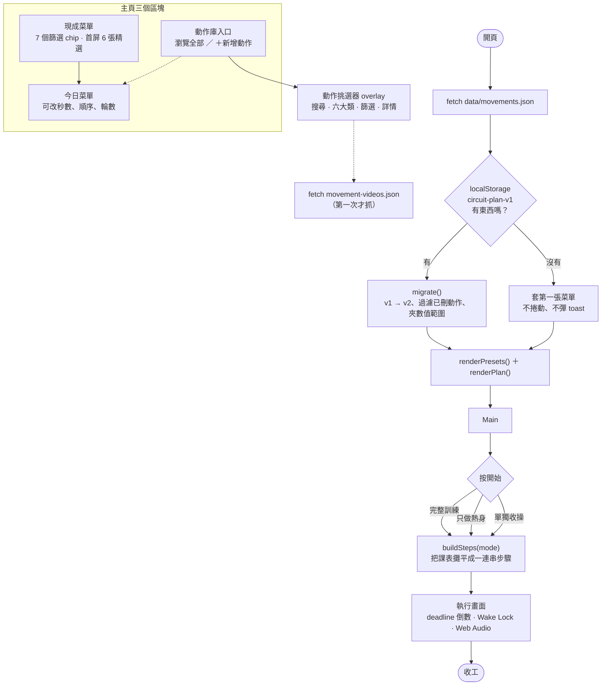
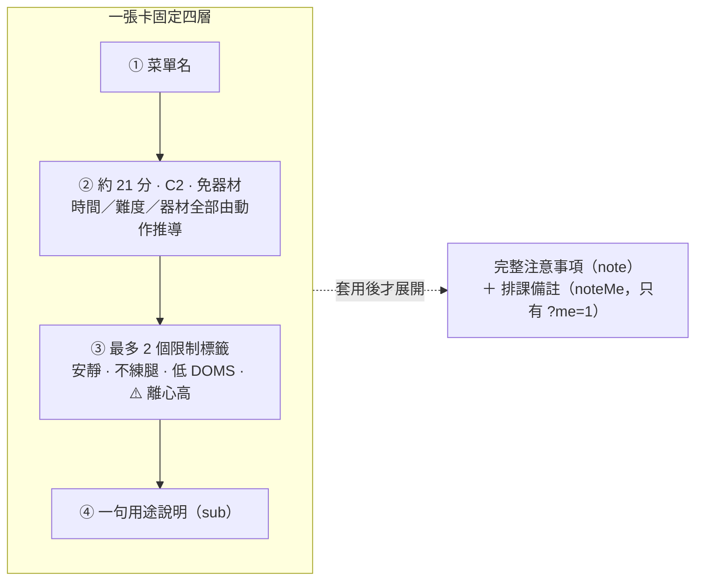
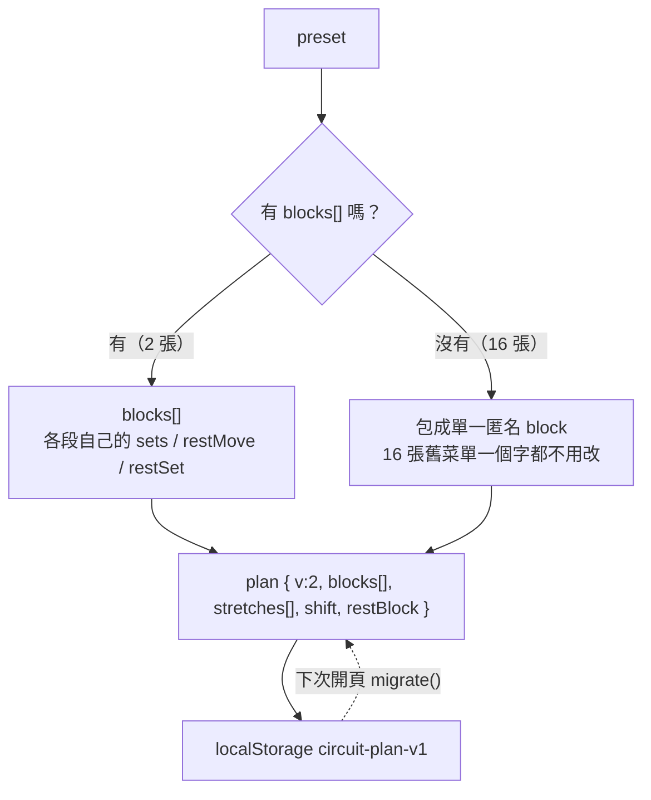
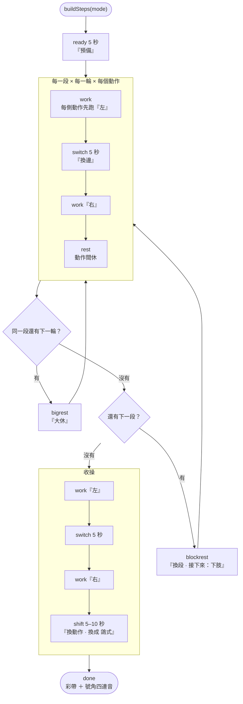
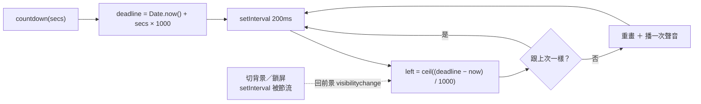
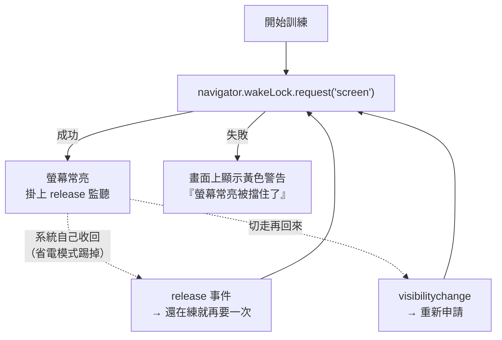
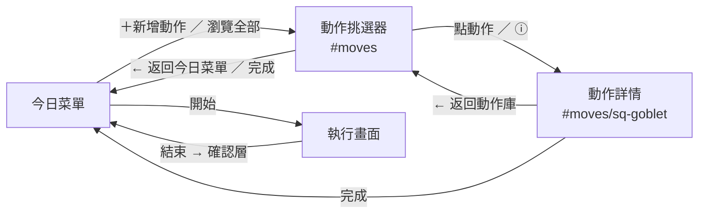
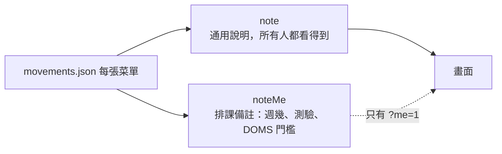
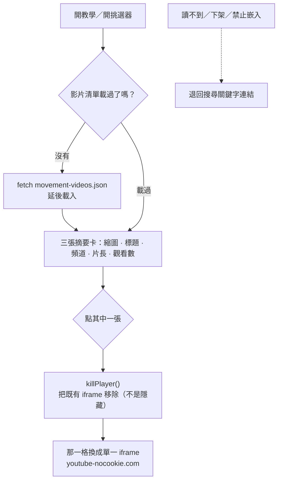
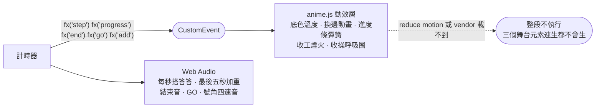

# 循環訓練 · circuit.html

> 一個檔案（[circuit.html](../circuit.html)，2,111 行）＋ 兩份 JSON。沒有 build step，
> CSS 與 JS 全部 inline，GitHub Pages 直接 serve。
>
> 對外它是一般的循環訓練工具；跟作者訓練週期有關的排課備註藏在 `?me=1` 後面（見 [§8](#8-公開個人分界)）。

| 檔案 | 大小 | 角色 | 什麼時候載 |
|---|---:|---|---|
| [`circuit.html`](../circuit.html) | 2,111 行 | 全部的畫面、計時器、音效、動效 | — |
| [`data/movements.json`](../data/movements.json) | 105 KB | 125 個動作 ＋ 18 張菜單 ＋ 11 個動作模式 ＋ 更新紀錄 | 開頁就抓（關鍵路徑） |
| [`data/movement-videos.json`](../data/movement-videos.json) | 170 KB | 360 支教學影片（涵蓋 120／125 個動作） | **延後**：第一次開教學或挑選器才抓 |
| [`vendor-anime-4.esm.min.js`](../vendor-anime-4.esm.min.js) | — | 動效層，純加法 | 非同步；載不到就當沒這回事 |
| [`scripts/check-circuit-data.js`](../scripts/check-circuit-data.js) | 146 行 | 資料檢查 ＋ 估時基準 | 手動 |
| [`scripts/research_movement_videos.py`](../scripts/research_movement_videos.py) | 512 行 | 影片離線採集 | 手動，一年跑不到幾次 |

---

## 1. 全貌



---

## 2. 兩種資料：動作與菜單

### 2.1 動作（125 個）

| 欄位 | 說明 |
|---|---|
| `pattern` | 11 個動作模式之一（`warmup` `push` `pull` `squat` `hinge` `lateral` `coord` `core` `loco` `calf` `stretch`）。挑選器把它們收成 **6 個大類**。 |
| `tier` | `C1`–`C4` 徒手由易到難；`B1`／`B2` 用家裡的重量。分布：C1 56、C2 35、C3 18、C4 5、B1 10、B2 1 |
| `unit` | 一律是 `time` 或 `time_each`。**全部用秒數**，不用次數 —— 次數要自己按「完成」才會前進，等於每個動作結束都要走去碰螢幕 |
| `default` | 預設秒數。`hint` 是照秒數回推的次數參考，只顯示、不控制 |
| `gear` | `[]`／`dumbbell`／`kettlebell`。11 個動作需要器材 |
| `doms` | 0–5 的離心損傷估計（手寫）。≥4 會在卡片與教學面板出警告 |
| `noisy` | 會跳或跺地的 7 個動作。挑選器的「安靜」篩選靠它 |
| `steps` / `wrong` / `cue` | `steps` 是教學面板的 2–3 步；`wrong` 是最常見錯誤；`cue` 是執行畫面的一行速讀版 |

### 2.2 菜單（18 張）



**時間、最高難度、器材聯集全部是算出來的**，JSON 裡沒有第二份會過期的 `duration`。
器材用「交集」判斷：五個動作都能用啞鈴 → 卡片寫「啞鈴」，不會含糊寫「有器材」。

分類欄位只有三個：

```json
{ "category": "targeted", "tags": ["quiet", "no-legs"], "featured": true }
```

- `category` 單值，負責主要分組（`full` 全身／`prepost` 運動前後／`targeted` 局部強化／`weights` 重量）
- `tags` 只放**限制**，不放賣點 —— 「快速」由算出來的時間負責
- `featured` 控制首屏，**維持 6 張**（檢查腳本會擋）

---

## 3. 課表模型：blocks

舊版每張菜單只有一個 `sets`／`restMove`／`restSet`，表達不了「熱身 1 輪／下肢 2 輪／肩臂 3 輪」。
v2 改成 `blocks[]`，每一段有自己的輪數與休息。



`blocks[].warm = true` 的段可以單獨跑（「只做熱身」按鈕就長在那一段的標題列上，
對稱於收操區的「單獨做收操」）。

**單段課表的畫面跟以前完全一樣** —— 一個組數旋鈕在下面。只有多段才會出現段落標題列，
這時全域旋鈕會收起來，輪數改在各段自己的標題列上調。

---

## 4. 執行器：課表怎麼變成一連串畫面



四種倒數狀態，顏色與聲音都不一樣：

| 狀態 | 顏色 | 最後五秒的聲音 |
|---|---|---|
| `work` 做 | 白／橘 | 音高一秒一秒**爬升** ＋ 畫面邊緣閃橘 |
| `rest` `bigrest` `blockrest` 休息 | 綠 | 同上 |
| `switch` `shift` 換位 | 青 | **低而輕的重複音**，跟「這組結束了」明顯分得開 |
| `ready` 預備 | 金 | 結束時是 GO 音 |

> **收操的換邊與換動作是後來補的。** 以前左側做完會直接跳右側、伸展 A 做完直接進 B，
> 估時也沒算，所以實際拿來收操時每一段都會少做前幾秒。現在轉場算進估時裡，
> 畫面上的時間就是真的會花掉的時間。

### 估時與步驟表是同一套規則

`estimate()` 與 `buildSteps()` 走同一組規則，所以**卡片上的時間就是實際會跑的時間**。
這件事有機器在守：[`scripts/check-circuit-data.js`](../scripts/check-circuit-data.js) 直接把
`circuit.html` 裡 `/* @estimate-core */` 標記那一段抽出來 `eval`，兩邊不可能漂。

驗收是 18 張菜單 × 每個模式，`buildSteps()` 的秒數總和 **完全等於** `estimate()`。

---

## 5. 倒數：為什麼用 deadline 不用 left--



以前是每秒 `left--`。手機進背景、鎖屏或被系統節流時 `setInterval` 會停頓，
回到前景後畫面上的秒數**不等於真實經過的時間**，而且愈跑愈慢。

改成 deadline 之後，畫面只是從 deadline 重算 —— 節流只是「少畫了幾格」，時間本身不會歪。
實測：一個 35 秒的動作模擬背景 12 秒後回前景，顯示剩 22 秒，跟真實時間完全吻合。

暫停是把 `deadline − now` 存起來，繼續時再加回去。

---

## 6. 螢幕會不會暗掉？（PWA 不是解法）

**不需要做成 PWA。** 讓螢幕保持常亮的是 **Screen Wake Lock API**，一般網頁就能用：

| 條件 | 狀況 |
|---|---|
| 安全 context | GitHub Pages 是 https ✅（用 `http://` 開就拿不到） |
| 分頁在前景 | 切走就會被收回，回來要重新申請 |
| Android Chrome | ✅ |
| iOS Safari | ✅ **16.4 起**（2023-03）；更舊的版本沒有 |
| 省電模式 | ❌ 會被擋下來 |



原本三件事只做了一半，現在補齊：

1. **失敗要講出來** —— 以前 `try/catch` 靜靜吞掉，你要等到第三組螢幕暗掉才發現。
   現在拿不到會在倒數下面顯示一行黃字，告訴你去關省電模式或自動鎖定。
2. **被系統收回要自己補回來** —— 省電模式踢掉時**不一定**會發 `visibilitychange`，
   所以另外接 `release` 事件。
3. **回前景要重新申請** —— `visibilitychange` 那邊本來就有。

### 那 PWA 到底能買到什麼？

| | 有沒有幫助 |
|---|---|
| 螢幕常亮 | ❌ 沒有。裝成 PWA 一樣要靠 Wake Lock |
| 桌面圖示、一鍵開啟 | ✅ 只要一份 `manifest.json`，**不需要 service worker** |
| 全螢幕（沒有瀏覽器上下列） | ✅ 倒數數字可以更大 |
| 離線可用 | ✅ 但需要 service worker |

**service worker 在這個 repo 有個大問題**：SW 的 scope 不能超過自己所在的目錄，
放在根目錄就會接管**整個站**（strava.html、所有 data/*.json 都會被它快取），
很容易吃到舊資料。要做只有兩條路：把 circuit.html 搬進 `/circuit/` 自己的目錄，
或是只加 `manifest.json` 不加 SW（拿圖示與全螢幕，放棄離線）。

**目前的判斷：先不做。** 螢幕的問題已經被 Wake Lock 解掉了，剩下的是方便性，
不值得為它動整站的結構。

---

## 7. 導航：一層 modal，返回鍵跟畫面上的箭頭做同一件事



規格（每一條都是為了「點來點去找不到怎麼回去」）：

- 左上角**永遠**是上一層，用 `← 返回動作庫` 這種箭頭＋文字，不只放 `✕`
- 右上角才是「完成／關掉整個流程」。兩顆**不共用**
- 只有「開挑選器」與「進動作詳情」算層級 —— 篩選、搜尋、播影片都不建 history，
  所以不會按十幾次才回得去
- 手機系統返回鍵、畫面上的 ←、Escape 走同一條路
- 返回列表時保留搜尋字、篩選與捲動位置；**重新打開**才清掉搜尋（新的來意）
- 關閉後焦點回到原本觸發的那顆按鈕
- 桌面是左右兩欄、手機是同一個面板推進到第二頁 —— 視覺上是兩種，
  技術與無障礙結構上**只有一層 modal**

**執行畫面是例外**：返回代表中止，所以會跳確認層（主按鈕是「繼續訓練」），
不會一按就整堂消失。手機返回鍵按下去也是跳確認層，不是離開頁面。

### 兩種來意共用同一個面板

| | `＋新增動作` | `瀏覽全部`／`#moves` |
|---|---|---|
| 標題 | 新增動作 | 動作庫 |
| 點動作列 | **直接加入** | **先開教學** —— 你是來讀的 |
| 網址 | 不變 | `#moves`／`#moves/<動作 id>`，可以貼給別人 |

新手模式（第一次造訪預設開啟，記在 localStorage）會讓 `＋新增動作` 也變成「先開教學」。

沒有另外開一個 `moves.html`：搜尋、六大類、篩選、詳情、影片那一整套已經在挑選器裡，
複製第二份只會開始漂。

---

## 8. 公開／個人分界

這一頁對外就是一個普通的循環訓練工具。預設畫面裡**沒有**：回主控台、週幾、
測驗窗口、要不要戴錶、CTL／校準，`<title>` 也不掛名字。



- `?me=1` 打開、`?me=0` 關掉，記在 localStorage `circuit-me`
- **畫面上沒有任何開關**；回主控台的連結是 ME 模式才用 JS 長出來的，靜態 HTML 裡沒有
- 三個地方會分岔：菜單的 `noteMe`、收工畫面的文案、高離心動作的警告文字
- **菜單結構與參數完全不受影響** —— 「我做了哪一張」照樣拿得去問 AI 推疲勞

---

## 9. 教學影片

360 支（120 個動作 × 3），離線採集、人工複核後寫進 `data/movement-videos.json`。

**不在瀏覽器即時搜尋 YouTube**：API key 會外洩、每次開動作都要等、結果每天都在變，
而且官方 `search.list` 預設額度是每天 100 次，120 個動作一天做不完。



規則：

- 預設**只載縮圖**（URL 由 `videoId` 推導，JSON 裡不重複寫）
- 全頁同時**最多一個播放器**。關閉時把 iframe 移除，不是 CSS 隱藏 —— 聲音才會真的停
- 用 `youtube-nocookie.com` 的 privacy-enhanced embed
- **訓練中不會自動播放**：執行畫面按「動作教學」會先暫停倒數，關掉後有 3、2、1
  重新就位，再把剩下的秒數接回去
- 讀不到影片清單時，文字教學、錯誤提醒與搜尋關鍵字全部照常 —— 菜單與計時完全不依賴它

### 影片資料是驗過的，不是照單全收

`videoId` 是最容易被憑空生出來的東西，所以 360 支的 356 個不重複 ID
**逐一打過 YouTube 官方 oEmbed**：全部回 200，0 個失效、0 個禁止嵌入。

一件要知道的事：採集是「先過相關性再依觀看數排序」，所以**有 19 個冷門動作三支都在
5 萬觀看以下**（熊爬轉身最高只有 52 次）。標籤寫「熱門教學」，但每張卡都印出觀看數
與快照日期，讓數字自己說話 —— 觀看數能證明熱門，不能單獨證明動作品質。

---

## 10. 動效層與音效層

兩層都是**純加法**，拔掉不影響練習本身。



動效層接的是計時器派出來的事件，**不碰 `R`、不碰 `setInterval`、不碰任何一顆按鈕**。
音效同理：拿筆電當計時器時眼睛不一定在螢幕上，所以聲音要能單獨講完進度。

---

## 11. 改東西之前

| 想改什麼 | 改哪裡 |
|---|---|
| 新增／修改菜單 | `data/movements.json` 的 `presets[]` |
| 新增動作 | `data/movements.json` 的 `moves[]`（`steps` 與 `wrong` 是必要的，不是選配） |
| 估時規則 | `circuit.html` 的 `@estimate-core` 區段 —— **檢查腳本會把它抽出來 eval**，別把標記弄丟 |
| 步驟展開 | `buildSteps()`。改完一定要確認秒數總和仍等於 `estimate()` |
| 任何提到週幾／測驗／戴錶的文字 | 包在 `ME ? ... : ...` 裡，或放進 `noteMe` |
| 重新採集影片 | `scripts/research_movement_videos.py`，規格見 [gemini-movement-video-research-prompt.md](gemini-movement-video-research-prompt.md) |

### 驗證

```bash
node scripts/check-circuit-data.js --times
```

會檢查：ID 唯一與參照存在、`sets`／`restMove`／`restSet`／`shift` 的範圍、
`category`／`tags` 字彙、精選張數是不是 6、伸展有沒有混進動作列表、
preset → plan 轉換前後的筆數對不對得起來，以及六張新菜單的估時基準。
最後印出 18 張菜單的完整／只熱身／只收操時間。

瀏覽器端要另外確認的（headless 量測，不要靠截圖 —— 這一頁的截圖會空白或陳舊）：

- 18 張菜單 × 每個模式，`buildSteps()` 秒數總和 == `estimate()`
- 375 px 下沒有橫向捲動、互動目標全部 ≥44 px、執行主按鈕 ≥54 px
- 四種啟動狀態：沒有 localStorage／v1 舊格式／只有收操／含已刪動作與亂數值
- 公開視圖掃一次可見文字，不能出現週幾、測驗、戴錶、CTL、回主控台

---

## 12. 更新紀錄

頂列右邊的「更新紀錄」按鈕，答的是「我什麼時候加了什麼動作／菜單」。

資料在 `movements.json` 的 `changelog[]`，手寫維護、新的排最前面：

```json
{ "date": "2026-08-30", "title": "補上五個最常漏掉的伸展",
  "moves": ["st-frog", "st-plantar"], "presets": [], "note": "…" }
```

- `moves`／`presets` 存的是 **id**，名稱在畫面上即時解析 —— 之後改名不用回頭補紀錄
- 已經刪掉的 id 會安靜跳過，不會留一個點不開的名字
- 動作名稱點得開教學面板（返回鍵會寫「返回更新紀錄」）
- 沒有新增東西的改版就只寫 `note`

檢查腳本會擋：日期格式、由新到舊的順序、id 存不存在、以及「這一筆等於沒說話」
（既沒有新增項目也沒有 note）。

> 為什麼放在 `movements.json` 而不是另一個檔？因為**加動作時就是在改這個檔** ——
> 放在一起才不會忘記補。它只佔 3 KB。

---

## 13. 相關文件

- [circuit-menu-expansion-plan.md](circuit-menu-expansion-plan.md) —— 這一輪改版的完整計畫與實作差異（§13）
- [gemini-movement-video-research-prompt.md](gemini-movement-video-research-prompt.md) —— 影片採集規格
- [../athlete/週末居家徒手訓練.md](../athlete/週末居家徒手訓練.md) —— 「居家完整課（分段）」那張菜單的來源
