# Strava 資料抓取流程（完整版）

> 對應檔案：[scripts/fetch-strava.js](../scripts/fetch-strava.js)
> 觸發點：`.github/workflows/strava-sync.yml`（cron `'30 1 * * *'` UTC = **09:30 Asia/Taipei**），或手動 `workflow_dispatch`，或本機 `node scripts/fetch-strava.js`

---

## 全流程圖

```mermaid
flowchart TD
  Start(["⏰ 觸發<br/>cron '30 1 * * *' UTC<br/>= 09:30 Asia/Taipei<br/>或手動 workflow_dispatch"]) --> Env

  subgraph INIT["① 初始化"]
    Env["讀環境變數<br/>本機: scripts/.env<br/>CI: GitHub Secrets"] --> Token
    Token["Step 1<br/>POST /oauth/token<br/>refresh_token → access_token<br/>（6hr 有效）"]
  end

  Token --> Stats["Step 2<br/>GET /athletes/{id}/stats<br/>取 YTD / All-time 總計"]

  Stats --> Acts{{"Step 3<br/>GET /athlete/activities<br/>FETCH_ALL=1?"}}
  Acts -- "否（日常）" --> ActsRecent["per_page=100&page=1<br/>取最近 100 筆"]
  Acts -- "是（首次/全量）" --> ActsAll["分頁迴圈 per_page=200<br/>每頁延遲 300ms<br/>直到回空陣列或 <200"]

  ActsRecent --> ReadOld
  ActsAll --> ReadOld

  ReadOld["讀舊資料快取<br/>strava.json + itt-segments.json<br/>（取 ITT efforts 數量多者）"] --> Build

  subgraph BUILD["④ buildJSON 純運算"]
    direction TB
    Build["分類活動<br/>Ride / Run / Swim / Weight"]
    MS["monthly_summary<br/>本月 km / hr / m / 次"]
    MG["monthly_goals<br/>count vs target<br/>status: danger / warning / done / over"]
    WQ["weekly_quest<br/>本週各項是否完成<br/>（週一 00:00 TPE 起算）"]
    MH["monthly_history<br/>FETCH_ALL=全月份<br/>否則只覆寫本月"]
    Recent["recent_rides / runs / swims / weights<br/>含 id 用於 Strava 連結"]
    Build --> MS --> MG --> WQ --> MH --> Recent
  end

  Recent --> Mode{"⑤ Detail enrichment 模式<br/>SCAN_SEGMENTS=1 或 FETCH_ALL=1?"}

  Mode -- "是（全史掃描）" --> ScanAll
  Mode -- "否（日常）" --> EnrichDaily

  subgraph SCAN["全史模式 scanSegmentsHistory"]
    direction TB
    ScanAll["過濾所有 ride 類型<br/>排除已知 activity_id"] --> ScanLoop
    ScanLoop["逐筆 GET /activities/{id}<br/>每筆延遲 400ms<br/>掃 segment_efforts"] --> ScanFilter
    ScanFilter["se.segment.id ∈ SEGMENT_IDS?<br/>{641218, 1761462, 7032136}"] --> NewEfforts1["新 segment efforts"]
    ScanLoop --> EnrichDaily2["再呼叫 enrichRideLaps<br/>補 recent_rides 的 top_laps"]
  end

  subgraph DAILY["日常模式 enrichRideLaps"]
    direction TB
    EnrichDaily["建 cache: ride.id → top_laps<br/>（從舊 strava.json）"] --> Budget
    Budget["LAP_FETCH_MAX=30<br/>未 cache 才打 API"] --> DetailCall
    DetailCall["GET /activities/{id}<br/>每筆延遲 350ms"]
    Laps["extractTopLaps<br/>篩 avg_watts ≥ 150W<br/>保留 lap_index 順序"]
    SegEff["segment_efforts<br/>篩 ITT id（同上）"]
    DetailCall --> Laps
    DetailCall --> SegEff
    SegEff --> NewEfforts2["新 segment efforts"]
    EnrichDaily2 --> DetailCall
  end

  NewEfforts1 --> Merge
  NewEfforts2 --> Merge

  subgraph SEGS["⑥ buildSegmentsData"]
    direction TB
    Merge["合併新舊 efforts<br/>by activity_id 去重"] --> SegMeta
    SegMeta["GET /segments/{id}<br/>更新 distance_km<br/>套用 SEGMENT_CUSTOM_NAMES"] --> PR
    PR["排序：日期降冪<br/>標 PR：min(elapsed_sec)"]
  end

  PR --> Write

  subgraph WRITE["⑦ 落檔"]
    direction TB
    Write["fs.writeFileSync"] --> F1["strava.json<br/>主資料"]
    Write --> F2["itt-segments.json<br/>ITT 獨立備份"]
  end

  F1 --> CI["GitHub Actions<br/>git add / commit / push"]
  F2 --> CI
  CI --> Pages["GitHub Pages CDN<br/>5 個前端頁面 fetch 渲染<br/>strava / aespa / maple / cs / lol"]

  style Start fill:#FC4C02,color:#fff
  style CI fill:#2ea043,color:#fff
  style Pages fill:#a855f7,color:#fff
```



---

## 執行模式對照

三個環境變數旗標決定行為：

| 模式 | `FETCH_ALL` | `SCAN_SEGMENTS` | activities 列表 | Detail enrichment | 用途 |
|------|:---:|:---:|---|---|---|
| 日常（cron） | – | – | 最近 100 筆 | `enrichRideLaps`，限 30 筆 | 每天 09:30 自動跑 |
| 補抓 ITT | – | `=1` | 最近 100 筆 | `scanSegmentsHistory` 全史 ride 掃 segment | 想撈舊 ITT 成績 |
| 首次 / 重灌 | `=1` | （自動觸發 scan） | 全史分頁 | 全史 scan + lap | 第一次 setup 或全量重建 |

額外旗標：
- `REFRESH_LAPS=1`：忽略 lap cache 重抓（仍受 `LAP_FETCH_MAX` 限制）
- `LAP_FETCH_MAX=N`：單次最多打多少次 detail API（預設 30）

---

## 關鍵邏輯細節

### ITT 區間偵測（`SEGMENT_IDS`）

```js
const SEGMENT_IDS = new Set([641218, 1761462, 7032136])
const SEGMENT_CUSTOM_NAMES = {
  641218:  '風櫃嘴ITT',
  1761462: '中社路ITT',
  7032136: '圓山-社子島砍鴨頭ITT',
}
```

每次 `GET /activities/{id}` 拿到 `detail.segment_efforts[]`，過濾出 `se.segment.id ∈ SEGMENT_IDS`，記錄：

```js
{
  activity_id, date,
  elapsed_sec, elapsed_str,  // 秒數 + 格式化字串 "M:SS" / "H:MM:SS"
  avg_watts, avg_heartrate
}
```

### LAP 合格條件（`extractTopLaps`）

```js
laps.filter(l => (l.average_watts || 0) >= 150)
    .sort((a, b) => (a.lap_index ?? 0) - (b.lap_index ?? 0))
```

- 門檻：`average_watts >= 150W`（沒有時間下限）
- 自動排除 `average_watts = null` 的 lap（暖身、冷身段）
- 保留原始 `lap_index` 順序（不依功率排序）
- 前端顯示：預設前 3 筆，超過時 `▼ +N 分段` 箭頭展開（上限 10 筆）

### 快取策略（避 Strava rate limit）

| 快取項目 | Key | 來源 | 失效條件 |
|---|---|---|---|
| `top_laps` | `ride.id` | 舊 `strava.json` 的 `recent_rides[].top_laps` | `REFRESH_LAPS=1` |
| segment efforts | `activity_id` Set | 舊 `segments[].efforts[].activity_id` 聯集 | 無（永久累積） |
| segment 距離 | `segId` | `existing.distance_km` | 每次都重打 `/segments/{id}` 更新 |

### 去重 + PR 計算

```js
// 合併新舊 efforts，by activity_id 去重
for (const e of newEfforts) {
  if (!knownIds.has(String(e.activity_id))) existing.push(e)
}
// 排序 + PR 標記
existing.sort((a, b) => b.date.localeCompare(a.date))
const prTime = Math.min(...existing.map(e => e.elapsed_sec))
const efforts = existing.map(e => ({ ...e, is_pr: e.elapsed_sec === prTime }))
```

### 時區處理

- **一律使用 `start_date_local`**（Strava 已轉好的活動所在地牆鐘時間字串）
- 切日：`.slice(0, 10)` 取 `YYYY-MM-DD`
- 切月：`.slice(0, 7)` 取 `YYYY-MM`
- 「現在」用 `new Date(Date.now() + 8*3600*1000)` 換成 TPE 牆鐘，再用 `getUTC*` 讀

---

## 環境變數總表

| 變數 | 必填 | 用途 |
|---|:---:|---|
| `STRAVA_CLIENT_ID` | ✅ | Strava App ID |
| `STRAVA_CLIENT_SECRET` | ✅ | Strava App Secret |
| `STRAVA_REFRESH_TOKEN` | ✅ | OAuth refresh token（需 `activity:read_all` scope） |
| `STRAVA_ATHLETE_ID` | ✅ | 自己的 athlete ID |
| `FETCH_ALL` | ⬜ | `=1` 拉全史活動清單 |
| `SCAN_SEGMENTS` | ⬜ | `=1` 對全史 ride 掃 ITT segment |
| `REFRESH_LAPS` | ⬜ | `=1` 忽略 lap cache 重抓 |
| `LAP_FETCH_MAX` | ⬜ | 單次最多 detail API 次數（預設 30） |

---

## 輸出檔案

| 檔案 | 內容 | 用途 |
|---|---|---|
| `strava.json` | 主資料（stats + monthly + recent + segments） | 5 個前端頁面 fetch |
| `itt-segments.json` | 僅 ITT segments 陣列 | 獨立備份；下次執行優先讀此檔（若 efforts 數量 ≥ strava.json 內版本） |

`strava.json` 頂層欄位：

```js
{
  updated_at,                              // ISO timestamp
  summary,                                 // YTD + All-time
  recent_rides[], recent_runs[],
  recent_swims[], recent_weights[],
  monthly_history[],                       // [{month, ride, run, swim, weight_training}, ...]
  monthly_summary,                         // 本月 km/hr/m/次
  monthly_goals,                           // {ride/run/swim/weight: {count, target, status}}
  weekly_quest,                            // {ride/run/swim/weight: bool}
  segments[]                               // ITT 三個 segment 陣列
}
```
