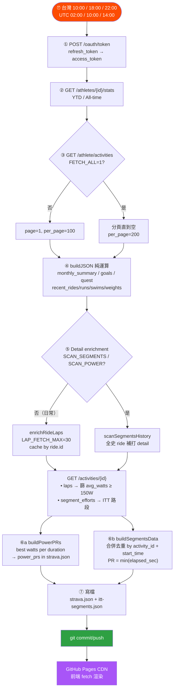

# Strava 管線（已棄用，仍在運轉）

> ## ⚠️ 這條路已經棄用
>
> **狀態**：還在跑，但**不再是主線**。等 Strava 付費訂閱到期就會拆掉。
> **取代它的是**：Garmin → intervals.icu → 原始 FIT，見 [主 README](../README.md)。
>
> ### 為什麼棄用
>
> | | Strava 路線 | intervals.icu 路線 |
> |---|---|---|
> | 費用 | **ITT 路段成績配對要 Strava 付費訂閱** | 免費 |
> | 資料 | 處理過的數字 | **手錶產出的原始 FIT，原封不動** |
> | 左右平衡 / 錶上 FTP / 逐秒功率 | 拿不到 | 有 |
> | ITT 計時 | **要付費訂閱**，訂閱斷了就沒了 | 自建偵測器，跟官方 91 筆逐筆吻合 |
> | 額度 | 100 req / 15 分、1000 / 日 | 5000 / 日、2500 / 15 分 |
>
> 自建偵測器與 Strava 官方在 **91 筆**可比對的成績上逐筆吻合，平均差 0.75 秒、
> 最大差 2.7 秒。**去 Strava 化不會失去資料** —— 但它的價值不是「比 Strava 準」，
> 而是不必付費、訂閱死了還在跑、而且改演算法就能重算全部歷史。
>
> > 📌 **更正**：這裡先前寫過「自建偵測器抓到關渡→美堤 25:07，Strava 全史 0 筆」。
> > **那是錯的。** 原因是 `scripts/fetch-strava.js` 打 activity detail 時沒帶
> > `include_all_efforts=true`（預設 false），Strava 只回「重點」efforts。
> > 補上參數重抓後那些成績 Strava 全都有。Strava 也**會**回頭把新路段配對到舊活動。
>
> ### 現在還靠 Strava 的只剩三件事
>
> 1. `data/strava.json` —— 儀表板的活動列表、年度統計、功率 PR（尚未搬家）
> 2. 新增 ITT 路段時，**拿一次**官方折線與路段 metadata
>    （`segment-streams.json`；拿到之後計時就完全不靠 Strava 了）
> 3. KOM / 全站排名 —— 這種全站資料**只有 Strava 有，搬不走**
>
> 訂閱到期前的封存作業見 [`scripts/harvest-strava.js`](../scripts/harvest-strava.js)：
> 它把第 2、3 項一次抓齊存進 `data/strava-archive/`，之後即使訂閱斷了，
> 已封存的路段仍可用 `scripts/merge-harvested-streams.js` 隨時接上自建計時。
>
> 這份文件保留完整的串接教學，因為第 2 項還會用到，而且它對想 fork 這個 repo
> 但只有 Strava 的人仍然可用。

---

## 目錄

- [Fork 後自己用（Strava 版完整教學）](#fork-後自己用strava-版完整教學)
- [自動同步流程](#自動同步流程)
- [環境變數](#環境變數)
- [Rate limit](#rate-limit)
- [本機測試](#本機測試)

---

## Fork 後自己用（Strava 版完整教學）

> 只有 Strava、沒有 Garmin 的人走這條。約 10–15 分鐘，**不需要寫任何程式**。
> 有 Garmin 的話請走 [主 README 的 intervals.icu 教學](../README.md#完整串接教學garmin--intervalsicu--這個-repo)，
> 那條免費而且拿得到原始檔。

### 前置

- GitHub 帳號（要能開 GitHub Pages）
- Strava 帳號（有運動紀錄）
- **想用 ITT 路段功能的話，需要 Strava 付費訂閱** —— segment efforts 是付費功能

### Step 1 · Fork 此 repo

1. 點右上角 **Fork** → 建到自己的帳號下
2. **Settings → Pages** → Source 選 `main` branch，Folder 選 `/(root)`
3. 記下 Pages URL：`https://{你的帳號}.github.io/{repo名稱}/`

### Step 2 · 建立 Strava API App

1. 前往 https://www.strava.com/settings/api
2. 點 **Create & Manage Your App**
3. 填寫：
   - **Application Name**：隨意（例：MyStravaSync）
   - **Category**：Data Importer
   - **Authorization Callback Domain**：填 `localhost`（給下一步授權用）
4. 建立後記下 `Client ID`（純數字）與 `Client Secret`（長字串）

### Step 3 · 取得 OAuth Refresh Token（一次性授權）

讓 GitHub Actions 機器人可以代你讀取資料。Refresh token 取得後**永久有效**（除非你撤銷）。

```powershell
# (a) 瀏覽器開以下 URL，把 YOUR_CLIENT_ID 換成 Step 2 的 Client ID
# https://www.strava.com/oauth/authorize?client_id=YOUR_CLIENT_ID&redirect_uri=http://localhost&response_type=code&scope=activity:read_all

# (b) 同意授權後瀏覽器會跳到 localhost（連線失敗沒關係）
#     從網址列複製 code= 後面那串：
#     http://localhost/?state=&code=abc123xyz&scope=read,activity:read_all
#                              ↑ 這段就是 code（只能用一次）

# (c) 用 code 換 refresh_token
$body = "client_id=YOUR_CLIENT_ID&client_secret=YOUR_CLIENT_SECRET&code=abc123xyz&grant_type=authorization_code"
Invoke-RestMethod -Method POST -Uri "https://www.strava.com/oauth/token" -Body $body
# 回傳 JSON 的 "refresh_token" 欄位，複製下來（很長一串）
```

### Step 4 · 設定 GitHub Secrets

前往 **Settings → Secrets and variables → Actions → New repository secret**，逐一建立：

| Secret 名稱 | 值來源 |
|------------|--------|
| `STRAVA_CLIENT_ID` | Step 2 |
| `STRAVA_CLIENT_SECRET` | Step 2 |
| `STRAVA_REFRESH_TOKEN` | Step 3 |
| `STRAVA_ATHLETE_ID` | Strava 登入後網址 `/athletes/數字`，那個數字就是 |

### Step 5 · 首次全量同步

**Actions → Strava Daily Sync → Run workflow**，勾選「全量抓取」後按 Run。

> 首次跑完，`data/strava.json` 和 `data/itt-segments.json` 會被 commit 回 repo，
> 之後每天台灣時間 10:00 / 18:00 / 22:00 自動增量更新。

### Step 6 · 設定 ITT 路段（選用，需付費訂閱）

編輯 [`data/itt-config.json`](../data/itt-config.json)：

```json
{
  "segments": [
    { "id": 641218, "nameZh": "風櫃嘴", "nameApi": "風櫃嘴ITT",
      "type": "CLIMB", "accent": "#e87c1a" }
  ]
}
```

- **找 Segment ID**：Strava 網頁開啟路段，URL 中的數字
  `https://www.strava.com/segments/`**`641218`**
- **`type` 可選**：`CLIMB` / `SPRINT` / `ENDURANCE`
- **`accent` 配色有語意**：山路走暖色家族（橘／琥珀／金／珊瑚），河濱平路走藍色家族。
  不要再開第二個高飽和冷色（綠／紫／青），會跟其他版塊打架。

加完之後跑兩步：

```bash
# 1. 補抓歷史成績（Actions → Strava Daily Sync → 勾 scan_segments）
#    它會自動改用全量並關掉 power_only，不必自己記
# 2. 補抓路段折線與地形（本機，只抓缺的、約 3-6 次 API）
node scripts/fetch-segment-streams.js
node scripts/fetch-segment-terrain.js
```

> ### ⚠️ 不要為了新路段跑全史掃描
>
> 全史掃描會對**每趟**騎乘打一次 detail API，很容易撞到 Strava 的讀取額度上限
> （實測就是這樣爆掉的，三條新路段的 metadata／折線／地形全部沒抓到）。
> 上面那兩支專用腳本只抓缺的路段，成本是全史掃描的零頭。
> 撞牆時等 15 分鐘的窗口過去再跑一次即可，已抓到的不會重抓。

`strava.html` 不需要改任何一行，路段卡片、3D 路線圖、自建計時都會自動出現。

> 💡 **第 2 步拿到折線之後，計時就不再需要 Strava。**
> `tools/tcx/segments.py` 直接讀 `segment-streams.json` 的折線對 FIT 做閘門偵測，
> `scripts/backfill-itt-efforts.py` 會把偵測到的成績補進 `itt-segments.json`。

---

## 自動同步流程

### 🍼 笨蛋版（30 秒看懂）

> 想像 Strava 是「便利商店」、`strava.json` 是「冰箱裡的便當」、網頁是「飯桌」。

```
台灣時間每天三次（10:00 / 18:00 / 22:00）
   ↓
機器人（GitHub Actions）拿著鑰匙去 Strava 便利商店
   ↓
把所有運動紀錄打包成一個便當盒（strava.json）
   ↓
放回家裡冰箱（commit + push 回 repo）
   ↓
你打開網頁 → 網頁從冰箱拿便當出來顯示
```

**重點**：網頁本身**不會**直接打 Strava，它只看「冰箱裡那個便當」。
所以如果剛運動完、便當還沒更新，網頁就還是舊的 → 這時候去手動催一下機器人就好。

**便當盒裡有什麼**（`strava.json` 結構）：年度／全時間統計、功率 PR（5s–60m）、
每月里程歷史、四種運動的活動清單（含 Strava activity_id）、ITT 區段成績。

### 🛠️ 工程師版

> 完整流程圖（含分支、API 細節、快取邏輯）見 [data-flow.md](data-flow.md)



> **`itt-segments.json` 是合併不是覆寫。**（`scripts/fetch-strava.js:693`）
> 去重鍵是 `activity_id + start_time`，不是 `activity_id` ——
> 同一趟刷四次中社是四筆，用 `activity_id` 去重會吃掉第 2..n 次。
> 因為是合併，`backfill-itt-efforts.py` 寫進去的自建成績不會被下一班洗掉。

---

## 環境變數

`scripts/.env`（gitignore）或 GitHub Secrets：

| 變數 | 必填 | 用途 |
|------|------|------|
| `STRAVA_CLIENT_ID` | ✅ | Strava App ID |
| `STRAVA_CLIENT_SECRET` | ✅ | Strava App Secret |
| `STRAVA_REFRESH_TOKEN` | ✅ | OAuth refresh token（需 `activity:read_all` scope） |
| `STRAVA_ATHLETE_ID` | ✅ | 自己的 athlete ID |
| `FETCH_ALL` | ⬜ | `=1` 拉全史；省略則只拉最近 100 筆 |
| `SCAN_SEGMENTS` | ⬜ | `=1` 對全史 ride 掃 ITT segment efforts |
| `SCAN_POWER` | ⬜ | `=1` 重掃功率 PR（會搭配全量活動） |
| `POWER_ONLY` | ⬜ | `=1` 只更新功率 PR，跳過 laps/segments enrichment |
| `RESCAN_SEG_DAYS` | ⬜ | `=N` 無視快取重掃最近 N 天騎乘的 segment efforts |
| `REFRESH_LAPS` | ⬜ | `=1` 忽略 lap 快取重新抓 |
| `LAP_FETCH_MAX` | ⬜ | 單次最多打多少 detail call（預設 30） |

---

## Rate limit

- **100 requests / 15 min**，**1000 / day**（讀取類）
- 全史掃描 300+ 筆活動 ≈ 300 detail calls → 必須分批 + `setTimeout(400ms)` 節流
- 全量首跑建議分兩次：先 `FETCH_ALL=1` 拉清單，等 15 分後再 `SCAN_SEGMENTS=1` 掃 segment

---

## 本機測試

```powershell
# 1. 建 scripts/.env（複製 4 個 secret）
# 2. 連線測試
.\scripts\test-strava-api.ps1                       # 看 token + 最近 10 筆
.\scripts\test-strava-api.ps1 -ActivityId 12345678  # 看單筆 lap

# 3. 跑同步（本機寫 strava.json）
node scripts/fetch-strava.js                                             # 增量
$env:FETCH_ALL="1"; $env:SCAN_SEGMENTS="1"; node scripts/fetch-strava.js # 全量
$env:SCAN_POWER="1"; $env:POWER_ONLY="1"; node scripts/fetch-strava.js   # 只補功率 PR

# 4. 單獨重掃功率 PR（快取清乾淨）
rm -f power-prs.json power-prs-cache.json && $env:SCAN_POWER="1"; node scripts/fetch-strava.js
```

**手動觸發**：Actions → **Strava Daily Sync** → Run workflow
